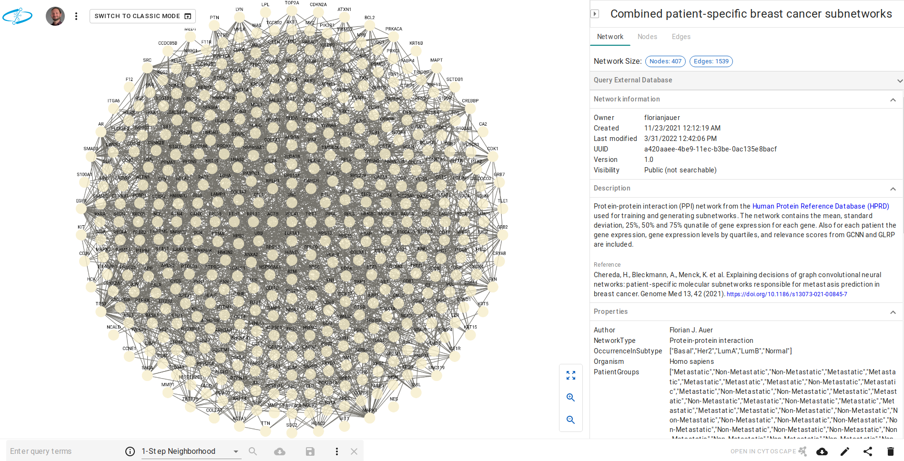

```{r setup, include=FALSE}
knitr::opts_chunk$set(tidy.opts=list(width.cutoff=55,
                                     args.newline = TRUE,
                                     arrow = TRUE),
                      tidy=TRUE)
```

```{r navigation, eval=HTML, results='asis', echo=FALSE}
res <- knitr::knit_child('navigation/navigation.Rmd', quiet = TRUE)
cat(res, sep = '\n')
```

# Load libraries

```{r libraries, warning=FALSE, message=FALSE}
# library(survival)
# library(RColorBrewer)
# library(GEOquery)
# library(igraph)
# library(dplyr)
# library(plyr)
# 
# library(kableExtra)
# library(stringr)
# library(xtable)
# library(pander)
# library(timeSeries)
# library(devtools)
library(igraph)
library(ndexr)
library(RCX)
```

# Load the required data

## Load the HPRD network from NDEx

The network is also available on the NDEx platform:

https://www.ndexbio.org/viewer/networks/079f4c66-3b77-11ec-b3be-0ac135e8bacf

The R package `ndexr` can be used to download the network from NDEx:

```{r ppiNdex}
ndex_con = ndex_connect()
ndexHPRD = ndex_find_networks(ndex_con, "HPRD AND owner:florianjauer")

print(ndexHPRD[c("name", "owner", "externalId", "nodeCount", "edgeCount")])
```

Alternatively, the network can be loaded directly using its UUID:

```{r ppiNdexLoad}
ppi_network_uuid = "079f4c66-3b77-11ec-b3be-0ac135e8bacf"
ppi_network_rcx = ndex_get_network(ndex_con, ppi_network_uuid)
print(ppi_network_rcx$metaData)

print(ppi_network_rcx$networkAttributes$name)
```

NDEx added automatically the version to the network attributes.

## Load patient data

Load the previously processed patient information about the 97 patients:

```{r patientsLoad}
patients = read.csv("data/processed/patients.csv", stringsAsFactors=F)
head(patients)
```

Load the gene expression in the patients with is previously calculated statistics:

```{r geStatisticsLoad}
ge_with_statistics = read.csv(file = "data/processed/ge_with_statistics.csv.gz")
print(unique(gsub("GSM[0-9]+","GSM*",colnames(ge_with_statistics))))
```

Load the previously deducted gene expression level based on the quantiles:

```{r geLevelsLoad}
ge_expression_level_by_quantiles = read.csv(file = "data/processed/ge_expression_level_by_quantiles.csv.gz")
print(unique(gsub("GSM[0-9]+","GSM*",colnames(ge_expression_level_by_quantiles))))
```

Load the results from the performed differential gene expression analysis:

```{r deGenes}
de = read.csv("data/processed/de.csv")
de_genes = de$prope[de$qvalue < 0.01]
print(de_genes)
```

Load relevance score of the genes for every patient:

```{r relevanceLoad}
relevance_score = read.csv("data/ppi_relevance_score.csv")
print(unique(gsub("GSM[0-9]+","GSM*",colnames(relevance_score))))
```

## Helping functions

The patient data is saved as attribute within an RCX network for every patient.
To be able to distinguish the patients and its attributes, the attributes are named `<patient-id>_<attribute>`, for example `GSM615195_ge_level`.
Since there are many patients (97) with different attributes, this function helps by condensing the patient ids to `GSM*` and notes the number of different patients for this attribute, which leads to `GSM*_ge_level`.

```{r helperAttributePrint}
printAttributes = function(aspect,
                           property = "name",
                           pattern = "GSM[0-9]+_",
                           replacement = "GSM*_"){
  
  property = aspect[,property]
  result = table(
    sub(pattern, replacement, unique(property))
  )
  
  result = data.frame(
    attribute = names(result),
    versions = as.numeric(result),
    occurrences = as.numeric(table(
      sub(pattern, replacement, property)
    ))
  )
  print(result)
  invisible(result)
}

nodeAttributes <- createNodeAttributes(
  propertyOf = c(1,2,3,4),
  name = c("GSM615195_GE", "Occurrence", "GSM491186_GE", "GSM615195_Score"),
  value = list(9.15, 11, 3.14, 0.98)
)

printAttributes(nodeAttributes)
```


# Data integration
For integrating previous genomic data into the HPRD network firstly create a new network from the HPRD network and update the network information:

```{r rcxUpdateNetworkAttributes, tidy=FALSE}
ppi_integrated_network_rcx <- ppi_network_rcx

networkAttributes <- createNetworkAttributes(
  name = c("name",
           "sourceNetwork",
           "description"),
  value = c("Integrated PPI network from HPRD with breast cancer gene expression from GEO",
            ppi_network_uuid,
            'Protein-protein interaction (PPI) network from the <a href="http://hprd.org/" target="_blank">Human Protein Reference Database (HPRD)</a> used for training and generating subnetworks. The network contains the mean, standard deviation, 25%, 50% and 75% qunatile of gene expression for each gene. Also for each patient the gene expression, gene expression levels by quartiles, and relevance scores from GCNN and GLRP are included.')
)

ppi_integrated_network_rcx <- updateNetworkAttributes(
  ppi_integrated_network_rcx, 
  networkAttributes, 
  replace = TRUE
)
```

Adding patient information to the network attributes

```{r rcxPatientInfo, tidy=FALSE}
networkAttributes <- createNetworkAttributes(
  name = c(
    "Patients",
    "PatientGroups",
    "PatientSubtype", 
    "PatientSurvivalYears",
    "OccurrenceInSubtype"
    ),
  value = list(
    patients$geo_accession,
    ifelse(patients$met.event == 1, "Metastatic", "Non-Metastatic"),
    patients$subtype,
    patients$mfs.years,
    unique(patients$subtype)
    )
)

ppi_integrated_network_rcx <- updateNetworkAttributes(
  ppi_integrated_network_rcx, 
  networkAttributes
)

print(ppi_integrated_network_rcx$networkAttributes)
```

Now include the relevance scores, gene expression and gene expression levels in the network for all 79 patients.
Also include the gene expression statistics, namely mean, standard deviation and 25%, 50% and 75% quantiles.

**Note: this will take a while**

```{r rcxNodeAttributesData, eval=FALSE}
for (counter in seq_len(length(patients$geo_accession))) {
	patientId = patients$geo_accession[counter]
	
  # progress logging
	cat(paste0("Adding node attributes for patient ", 
						 patientId," (",counter,"/",length(patients$geo_accession),")",
						 "."))
  
  # add score as attribute to the nodes
  sel_nodes = match(ppi_integrated_network_rcx$nodes$name, relevance_score$probe)
  nodeAttributes = createNodeAttributes(
    propertyOf = ppi_integrated_network_rcx$nodes$id, 
    name = rep(paste0(patientId,"_Score"), length(sel_nodes)),
    value = relevance_score[sel_nodes, patientId]
  )
  ppi_integrated_network_rcx = updateNodeAttributes(ppi_integrated_network_rcx, nodeAttributes)
  
  cat(".")
  # add gene expression as attribute to the nodes
  # sel_nodes = match(ppi_integrated_network_rcx$nodes$name, rownames(ge_patients))
  sel_nodes = match(ppi_integrated_network_rcx$nodes$name, ge_with_statistics$probe)
  nodeAttributes = createNodeAttributes(
    propertyOf = ppi_integrated_network_rcx$nodes$id, 
    name = rep(paste0(patientId,"_GE"), length(sel_nodes)),
    value = ge_with_statistics[sel_nodes, patientId]
  )
  ppi_integrated_network_rcx = updateNodeAttributes(ppi_integrated_network_rcx, nodeAttributes)

  cat(".")
  # add gene expression level as attribute to the nodes
  sel_nodes = match(ppi_integrated_network_rcx$nodes$name, ge_expression_level_by_quantiles$probe)
  nodeAttributes = createNodeAttributes(
    propertyOf = ppi_integrated_network_rcx$nodes$id, 
    name = rep(paste0(patientId,"_GE_Level"), length(sel_nodes)),
    value = ge_expression_level_by_quantiles[sel_nodes, patientId]
  )
  ppi_integrated_network_rcx = updateNodeAttributes(ppi_integrated_network_rcx, nodeAttributes)
  cat("done\n")
}

## include gene expression statistics
## mean
cat("Adding mean as attribute to the nodes...")
sel_nodes = match(ppi_integrated_network_rcx$nodes$name, ge_with_statistics$probe)
ppi_integrated_network_rcx = updateNodeAttributes(
  ppi_integrated_network_rcx, 
  createNodeAttributes(
    propertyOf = ppi_integrated_network_rcx$nodes$id, 
    name = rep("GE_Mean", length(sel_nodes)),
    value = ge_with_statistics[sel_nodes, "mean"]
  )
)
cat("done\n")

## standard deviation
cat("Adding standard deviation as attribute to the nodes...")
ppi_integrated_network_rcx = updateNodeAttributes(
  ppi_integrated_network_rcx, 
  createNodeAttributes(
    propertyOf = ppi_integrated_network_rcx$nodes$id, 
    name = rep("GE_StdDev", length(sel_nodes)),
    value = ge_with_statistics[sel_nodes, "stdev"]
  )
)
cat("done\n")

## 25% quantile
cat("Adding 25% quantile as attribute to the nodes...")
ppi_integrated_network_rcx = updateNodeAttributes(
  ppi_integrated_network_rcx, 
  createNodeAttributes(
    propertyOf = ppi_integrated_network_rcx$nodes$id, 
    name = rep("GE_Q25", length(sel_nodes)),
    value = ge_with_statistics[sel_nodes, "Q25"]
  )
)
cat("done\n")

## 50% quantile
cat("Adding 50% quantile as attribute to the nodes...")
ppi_integrated_network_rcx = updateNodeAttributes(
  ppi_integrated_network_rcx, 
  createNodeAttributes(
    propertyOf = ppi_integrated_network_rcx$nodes$id, 
    name = rep("GE_Q50", length(sel_nodes)),
    value = ge_with_statistics[sel_nodes, "Q50"]
  )
)
cat("done\n")
  
## 75% quantile
cat("Adding 75% quantile as attribute to the nodes...")
ppi_integrated_network_rcx = updateNodeAttributes(
  ppi_integrated_network_rcx, 
  createNodeAttributes(
    propertyOf = ppi_integrated_network_rcx$nodes$id, 
    name = rep("GE_Q75", length(sel_nodes)),
    value = ge_with_statistics[sel_nodes, "Q75"]
  )
)
cat("done\n")

## differential expression
cat("Adding pvalue of differential expression as attribute to the nodes...")
sel_nodes = match(ppi_integrated_network_rcx$nodes$name, de$prope)
ppi_integrated_network_rcx = updateNodeAttributes(
  ppi_integrated_network_rcx, 
  createNodeAttributes(
    propertyOf = ppi_integrated_network_rcx$nodes$id, 
    name = rep("pvalue", length(sel_nodes)),
    value = de[sel_nodes, "pvalue"]
  )
)
cat("done\n")

cat("Adding qvalue of differential expression as attribute to the nodes...")
ppi_integrated_network_rcx = updateNodeAttributes(
  ppi_integrated_network_rcx, 
  createNodeAttributes(
    propertyOf = ppi_integrated_network_rcx$nodes$id, 
    name = rep("qvalue", length(sel_nodes)),
    value = de[sel_nodes, "qvalue"]
  )
)
cat("done\n")

cat("Adding significance of differential expression as attribute to the nodes...")
sel_nodes = match(de_genes, ppi_integrated_network_rcx$nodes$name)
ppi_integrated_network_rcx = updateNodeAttributes(
  ppi_integrated_network_rcx, 
  createNodeAttributes(
    propertyOf = ppi_integrated_network_rcx$nodes$id[sel_nodes], 
    name = rep("significant", length(sel_nodes)),
    value = rep(TRUE, length(sel_nodes))
  )
)
cat("done\n")

cat("Node attributes:\n")
printAttributes(ppi_integrated_network_rcx$nodeAttributes)
```

With a better insight into the RCX data structure, a faster but not as clear version could be used.
To avoid temporally variables be loaded into the global environment, a new environment is created and used only for the calculation.

```{r rcxNodeAttributesDataTest, include=FALSE}
process_rcxNodeAttributesData = file.exists("data/processed/ppi_integrated_network_rcx.RDS")
```

```{r rcxNodeAttributesDataFast, eval=!process_rcxNodeAttributesData}
## Same as above, but faster
## run in a separate environment to omit local variables
rcx_integration = new.env()
local({
  tmp_rel_po = c()
  tmp_rel_n = c()
  tmp_rel_v = c()
  
  tmp_ge_po = c()
  tmp_ge_n = c()
  tmp_ge_v = c()
  
  tmp_level_po = c()
  tmp_level_n = c()
  tmp_level_v = c()
  
  for (counter in seq_len(length(patients$geo_accession))) {
  	patientId = patients$geo_accession[counter]
  	
    # progress logging
    cat(paste0("Prepare node attributes for patient ", 
               patientId," (",counter,"/",length(patients$geo_accession),")",
               "."))
  
    # add score as attribute to the nodes
    sel_nodes = match(ppi_integrated_network_rcx$nodes$name, relevance_score$probe)
    tmp_rel_po = c(tmp_rel_po, ppi_integrated_network_rcx$nodes$id)
    tmp_rel_n = c(tmp_rel_n, rep(paste0(patientId,"_Score"), length(sel_nodes)))
    tmp_rel_v = c(tmp_rel_v, relevance_score[sel_nodes, patientId])
    cat(".")
    # add gene expression as attribute to the nodes
    # sel_nodes = match(ppi_integrated_network_rcx$nodes$name, rownames(ge_patients))
    sel_nodes = match(ppi_integrated_network_rcx$nodes$name, ge_with_statistics$probe)
    tmp_ge_po = c(tmp_ge_po, ppi_integrated_network_rcx$nodes$id)
    tmp_ge_n = c(tmp_ge_n, rep(paste0(patientId,"_GE"), length(sel_nodes)))
    tmp_ge_v = c(tmp_ge_v, ge_with_statistics[sel_nodes, patientId])
    cat(".")
    # add gene expression level as attribute to the nodes
    sel_nodes = match(ppi_integrated_network_rcx$nodes$name, ge_expression_level_by_quantiles$probe)
    tmp_level_po = c(tmp_level_po, ppi_integrated_network_rcx$nodes$id)
    tmp_level_n = c(tmp_level_n, rep(paste0(patientId,"_GE_Level"), length(sel_nodes)))
    tmp_level_v = c(tmp_level_v, ge_expression_level_by_quantiles[sel_nodes, patientId])
    cat("done\n")
  }
  
  # add score as attribute to the nodes
  cat("Adding score as attribute to the nodes...")
  ppi_integrated_network_rcx = updateNodeAttributes(
    ppi_integrated_network_rcx, 
    createNodeAttributes(
      propertyOf = tmp_rel_po, 
      name = tmp_rel_n,
      value = tmp_rel_v
    )
  )
  cat("done\n")
  
  # add gene expression as attribute to the nodes
  cat("Adding gene expression as attribute to the nodes...")
  ppi_integrated_network_rcx = updateNodeAttributes(
    ppi_integrated_network_rcx, 
    createNodeAttributes(
      propertyOf = tmp_ge_po, 
      name = tmp_ge_n,
      value = tmp_ge_v
    )
  )
  cat("done\n")
  
  # add gene expression level as attribute to the nodes
  cat("Adding gene expression level as attribute to the nodes...")
  ppi_integrated_network_rcx = updateNodeAttributes(
    ppi_integrated_network_rcx, 
    createNodeAttributes(
      propertyOf = tmp_level_po, 
      name = tmp_level_n,
      value = tmp_level_v
    )
  )
  cat("done\n")
  
  ## include gene expression statistics
  ## mean
  cat("Adding mean as attribute to the nodes...")
  sel_nodes = match(ppi_integrated_network_rcx$nodes$name, ge_with_statistics$probe)
  ppi_integrated_network_rcx = updateNodeAttributes(
    ppi_integrated_network_rcx, 
    createNodeAttributes(
      propertyOf = ppi_integrated_network_rcx$nodes$id, 
      name = rep("GE_Mean", length(sel_nodes)),
      value = ge_with_statistics[sel_nodes, "mean"]
    )
  )
  cat("done\n")
  
  ## standard deviation
  cat("Adding standard deviation as attribute to the nodes...")
  ppi_integrated_network_rcx = updateNodeAttributes(
    ppi_integrated_network_rcx, 
    createNodeAttributes(
      propertyOf = ppi_integrated_network_rcx$nodes$id, 
      name = rep("GE_StdDev", length(sel_nodes)),
      value = ge_with_statistics[sel_nodes, "stdev"]
    )
  )
  cat("done\n")
  
  ## 25% quantile
  cat("Adding 25% quantile as attribute to the nodes...")
  ppi_integrated_network_rcx = updateNodeAttributes(
    ppi_integrated_network_rcx, 
    createNodeAttributes(
      propertyOf = ppi_integrated_network_rcx$nodes$id, 
      name = rep("GE_Q25", length(sel_nodes)),
      value = ge_with_statistics[sel_nodes, "Q25"]
    )
  )
  cat("done\n")
  
  ## 50% quantile
  cat("Adding 50% quantile as attribute to the nodes...")
  ppi_integrated_network_rcx = updateNodeAttributes(
    ppi_integrated_network_rcx, 
    createNodeAttributes(
      propertyOf = ppi_integrated_network_rcx$nodes$id, 
      name = rep("GE_Q50", length(sel_nodes)),
      value = ge_with_statistics[sel_nodes, "Q50"]
    )
  )
  cat("done\n")
  
  ## 75% quantile
  cat("Adding 75% quantile as attribute to the nodes...")
  ppi_integrated_network_rcx = updateNodeAttributes(
    ppi_integrated_network_rcx, 
    createNodeAttributes(
      propertyOf = ppi_integrated_network_rcx$nodes$id, 
      name = rep("GE_Q75", length(sel_nodes)),
      value = ge_with_statistics[sel_nodes, "Q75"]
    )
  )
  cat("done\n")
  
  ## differential expression
  cat("Adding pvalue of differential expression as attribute to the nodes...")
  sel_nodes = match(ppi_integrated_network_rcx$nodes$name, de$prope)
  ppi_integrated_network_rcx = updateNodeAttributes(
  	ppi_integrated_network_rcx, 
  	createNodeAttributes(
  		propertyOf = ppi_integrated_network_rcx$nodes$id, 
  		name = rep("pvalue", length(sel_nodes)),
  		value = de[sel_nodes, "pvalue"]
  	)
  )
  cat("done\n")
  
  cat("Adding qvalue of differential expression as attribute to the nodes...")
  ppi_integrated_network_rcx = updateNodeAttributes(
  	ppi_integrated_network_rcx, 
  	createNodeAttributes(
  		propertyOf = ppi_integrated_network_rcx$nodes$id, 
  		name = rep("qvalue", length(sel_nodes)),
  		value = de[sel_nodes, "qvalue"]
  	)
  )
  cat("done\n")
  
  cat("Adding significance of differential expression as attribute to the nodes...")
  sel_nodes = match(de_genes, ppi_integrated_network_rcx$nodes$name)
  ppi_integrated_network_rcx = updateNodeAttributes(
  	ppi_integrated_network_rcx, 
  	createNodeAttributes(
  		propertyOf = ppi_integrated_network_rcx$nodes$id[sel_nodes], 
  		name = rep("significant", length(sel_nodes)),
  		value = rep(TRUE, length(sel_nodes))
  	)
  )
  cat("done\n")
},
rcx_integration)  ## the local environment

## retrieve the results from the local environment
ppi_integrated_network_rcx = rcx_integration$ppi_integrated_network_rcx

## delete the local environment
rm(rcx_integration)

cat("Node attributes:\n")
printAttributes(ppi_integrated_network_rcx$nodeAttributes)
```


```{r rcxIntegratedLoad, echo=FALSE, eval=process_rcxNodeAttributesData}
ppi_integrated_network_rcx = readRDS("tmp/ppi_integrated_network_rcx.RDS")
## produce same output as for creation
for (patientId in patients$geo_accession) {
  cat(paste0("Adding node attributes for patient ", patientId, "...done\n"))
}

cat("Adding mean as attribute to the nodes...done\n")
cat("Adding standard deviation as attribute to the nodes...done\n")
cat("Adding 25% quantile as attribute to the nodes...done\n")
cat("Adding 50% quantile as attribute to the nodes...done\n")
cat("Adding 75% quantile as attribute to the nodes...done\n")
cat("Adding pvalue of differential expression as attribute to the nodes...done\n")
cat("Adding qvalue of differential expression as attribute to the nodes...done\n")
cat("Adding significance of differential expression as attribute to the nodes...done\n")

cat("Node attributes:\n")
printAttributes(ppi_integrated_network_rcx$nodeAttributes)
```

## Save integrated PPI network

```{r rcxIntegratedSave, eval=!process_rcxNodeAttributesData, include=FALSE}
## Save the data
writeCX(ppi_integrated_network_rcx, "tmp/ppi_integrated_network_rcx.cx")
saveRDS(ppi_integrated_network_rcx, "data/processed/ppi_integrated_network_rcx.RDS")
```

To make the network available to for further analyses, we can upload the network to the NDEx platform (https://www.ndexbio.org/). 
Of course for this an account is required.

```{r ppiNdexUpload, eval=FALSE}
ndex_con = ndex_connect(username = "florianjauer", password = "****")
ndexHPRDuuid = ndex_create_network(ndex_con, ppi_network_rcx)
ndexHPRDuuid
```
```{r ppiNdexUpload2, include=FALSE}
ndexHPRDuuid = "833b1cee-42f6-11ec-b3be-0ac135e8bacf"
ndexHPRDuuid
```

Until now, the network is only visible to the owner.
To change that, and make it visible to everyone, we have to update this property:

```{r ppiNdexVisibility, eval=FALSE}
ndex_network_set_systemProperties(
  ndex_con, 
  ndexHPRDuuid, 
  visibility = TRUE
)
```

The PPI network with integrated data is also available on NDEx, so the above time consuming integration steps don't have to be repeated every time:

```{r ppiIntegratedNDExLoad, eval=FALSE}
ppi_integrated_network_rcx = ndex_get_network(ndex_con, "833b1cee-42f6-11ec-b3be-0ac135e8bacf")
```

# Patient-specific subnetworks
## Relevant genes

The subnetworks are created based on the top 140 most relevant genes for each patient.
To get the 140 most relevant genes for each patient, first lets find out the least relevance score of the top 140 genes (i. e. threshold) for every patient:

```{r getThreshold}
topNr=140

thresholds = sapply(patients$geo_accession, function(patientId){
  ## get the scores for one patient
  ## column names of relevance score = gene ids + patientIdCol
  score = as.numeric(relevance_score[,patientId])
  
  ## check if there are less genes than topNr
  topNr = ifelse(length(score) > topNr,
                 topNr,
                 length(score))
  ## return the score at topNr (=threshold)
  return(sort(score, decreasing = TRUE)[topNr])
})

boxplot(thresholds)
title("Thresholds for the patients by the top 140 most relevant proteins")
```

Now get the relevant genes for all patients (should be 140 for every patient)

```{r getRelevantGenes}
relevant_genes = lapply(patients$geo_accession, function(patientId){
  # get the only the scores for a patient
  score = relevance_score[,patientId]
  
  # Filter genes with threshold for patient
  sel_scores = score >= thresholds[patientId]
  # The genes are the column names
  rel_genes = relevance_score$probe[sel_scores]
  
  return(rel_genes)
})

names(relevant_genes) = patients$geo_accession

print(sapply(relevant_genes, length))
```

Generate subnetworks and remove isolate nodes, and corresponding edges

```{r getRelevantGenesRemoveIsolate}
relevant_genes = lapply(relevant_genes, function(rel_genes){
  tmp_nodes = ppi_integrated_network_rcx$nodes
  tmp_edges = ppi_integrated_network_rcx$edges
  
  ## select node in the subnetwork
  sel_nodes = tmp_nodes$name %in% rel_genes
  tmp_nodes = tmp_nodes[sel_nodes,]
  
  ## select edges that start AND end in the selected nodes
  sel_edges = tmp_edges$source %in% tmp_nodes$id & tmp_edges$target %in% tmp_nodes$id
  tmp_edges = tmp_edges[sel_edges,]
  
  ## remove isolate nodes
  sel_nodes = tmp_nodes$id %in% tmp_edges$source | tmp_nodes$id %in% tmp_edges$target
  tmp_nodes = tmp_nodes[sel_nodes,]
  return(tmp_nodes$name)
})

print(sapply(relevant_genes, length))

cat("Number of total distinct relevant genes:\n")
length(unique(unlist(relevant_genes)))
```

## Molecular Tumor Board (MTB) Report

This script filters SNVs and CNVs using gene-drug public databases. 
Then classifies the variants into levels of evidence and finally presents the results.

The expression of each gene can be found in column "Patient.Expr". The expression is devidied into three groups:

- HIGH: above 75% quantile
- NOMRAL: between 25%-75% quantile
- LOW: below 25% quantile

In "MTB-report/results_curated" the results are limited to those in which "Known Var" matches with the expression of the gene (eg. HIGH expression corresponds to GoF evidence). For normal expression the decision is unclear.

### Perform MTB analysis

All necessary scripts and resources are placed in the `MTB` directory of this repository.
The code for performing the MTB analysis is contained in the `MTB/mtb_analysis.R` file:
```{r, code=xfun::read_utf8('MTB/mtb_analysis.R'), eval=FALSE}
```

The script is loaded into a dedicated environment to avoid side effects, and the `mtb_analysis` function is called to perform the analysis and to retrieve the results:

```{r MTBresults, warning=FALSE}
mtb = new.env()
source("MTB/mtb_analysis.R", local = mtb)
mtb_results = mtb$mtb_analysis(
  patients = patients$geo_accession,
  exprs.quant = ge_expression_level_by_quantiles,
  relevant.genes = relevant_genes,
  cancer = "BRCA",
  verbose = TRUE
)
rm(mtb)
```


### Include MTB results in the network

For the sake of the visualization the results of the MTB analysis for a gene are simply stored as `TRUE` for those genes in the corresponding patient.
Additionally all results are kept for those genes within the network, namely cancer, confidence level, drugs, evidences, known variations, predictions, and references.


```{r rcxNodeAttributesMTBData, warning=FALSE}
## MTB columns
mtb_attributes = c(
  Cancer = "Cancer", 
  KnownVar = "Known Var", 
  Prediction = "Predicts", 
  Drugs = "Drugs", 
  Evidence = "Evidence", 
  Reference = "Ref", 
  ConfidenceLevel = "level")

mtb_nodeAttributes = NULL

for(patientId in patients$geo_accession){
  cat(paste0("MTB patient ", patientId))
  if(nrow(mtb_results[[patientId]]) != 0){
    genes = unique(mtb_results[[patientId]]$Gene)
    
    for(gene in genes){
      ## Get the node id for the gene
      tmp_gene_id = ppi_integrated_network_rcx$nodes$id[
        ppi_integrated_network_rcx$nodes$name == gene
        ]
      
      ## Add a boolean indicator for the gene
      ## (for visualization)
      res = createNodeAttributes(
            propertyOf = tmp_gene_id,
            name = paste0(patientId,"_MTB"),
            value = TRUE
          )
      
      if(is.null(mtb_nodeAttributes)){
        mtb_nodeAttributes = res
      }else{
        mtb_nodeAttributes = updateNodeAttributes(
          mtb_nodeAttributes,
          res
        )
      }
      
      cat(".")
      
      ## Add all MTB attributes as ordered lists
      tmp_gene = c()
      for (attr_i in seq(length(mtb_attributes))) {
        tmp_gene = append(tmp_gene, gene)
        
        attr_name = mtb_attributes[attr_i]
        attr_called = names(mtb_attributes)[attr_i]
        
        sel_gene = mtb_results[[patientId]]$Gene == gene
        
        tmp_mtb_value = mtb_results[[patientId]][,attr_name][sel_gene]
        tmp_mtb_value[is.na(tmp_mtb_value)] = ""
        
        mtb_nodeAttributes = updateNodeAttributes(
          mtb_nodeAttributes,
          createNodeAttributes(
            propertyOf = tmp_gene_id,
            name = paste0(patientId,"_MTB_",attr_called),
            value = list(tmp_mtb_value),
            isList = TRUE
          )
        )
        
        cat(".")
      }
    }
  }
  cat("done\n")
}


ppi_integrated_network_rcx = updateNodeAttributes(
  ppi_integrated_network_rcx, 
  mtb_nodeAttributes
)
```

```{r rcxNodeAttributesMTBPrint}
printAttributes(ppi_integrated_network_rcx$nodeAttributes)
```

## Create patient-specific subnetworks


```{r getCombinedSubnetwork}
createCombinedSubnetwork = function(ppi_integrated_network_rcx) {
	all_rel_genes = unique(unlist(relevant_genes))
	
	tmp_nodes = ppi_integrated_network_rcx$nodes
	tmp_edges = ppi_integrated_network_rcx$edges
	
	## select node in the subnetwork
	sel_nodes = tmp_nodes$name %in% all_rel_genes
	tmp_nodes = tmp_nodes[sel_nodes,]
	
	## select edges that start AND end in the selected nodes
	sel_edges = tmp_edges$source %in% tmp_nodes$id & tmp_edges$target %in% tmp_nodes$id
	tmp_edges = tmp_edges[sel_edges,]
	
	ppi_integrated_network_rcx$nodes = tmp_nodes
	ppi_integrated_network_rcx$edges = tmp_edges
	
	## remove all attributes not included in the nodes
	ppi_integrated_network_rcx$nodeAttributes = ppi_integrated_network_rcx$nodeAttributes[
		ppi_integrated_network_rcx$nodeAttributes$propertyOf %in% ppi_integrated_network_rcx$nodes$id,
	]
	
	for(patientId in names(relevant_genes)){
		## get ids of relevant genes for patients
		rel_gene_ids = ppi_integrated_network_rcx$nodes$id[
			ppi_integrated_network_rcx$nodes$name %in% relevant_genes[[patientId]]
		]
		
		## select node attributes relevant for patient
		sel_node_attr = startsWith(ppi_integrated_network_rcx$nodeAttributes$name, patientId)
		keep_node_attr = ppi_integrated_network_rcx$nodeAttributes$propertyOf %in% rel_gene_ids
		remove_node_attr = sel_node_attr & !keep_node_attr
		
		ppi_integrated_network_rcx$nodeAttributes = ppi_integrated_network_rcx$nodeAttributes[!remove_node_attr,]
	}
	
	ppi_integrated_network_rcx = updateMetaData(ppi_integrated_network_rcx)
}

combined_subnetwork_rcx = createCombinedSubnetwork(ppi_integrated_network_rcx)

combined_subnetwork_rcx = updateNetworkAttributes(
	combined_subnetwork_rcx,
	createNetworkAttributes(
		name="name",
		value = "Combined patient-specific breast cancer subnetworks"
	)                                       
)

print(combined_subnetwork_rcx$metaData)
printAttributes(combined_subnetwork_rcx$nodeAttributes)
```

Include the number of occurrences of the genes in the patients

```{r addOccurrences}
getOccurrences = function(network){
  gene_occurrences = table(unlist(relevant_genes))
  gene_occurrences_po = network$nodes$id[match(names(gene_occurrences), network$nodes$name)]
  names(gene_occurrences) = NULL
  
  result = createNodeAttributes(
      propertyOf = gene_occurrences_po,
      name = rep("Occurrence", length(gene_occurrences)),
      value = gene_occurrences,
      dataType = rep("integer", length(gene_occurrences))
    )
  return(result)
}

occurrence = getOccurrences(combined_subnetwork_rcx)
combined_subnetwork_rcx = updateNodeAttributes(
  combined_subnetwork_rcx,
  occurrence
)

printAttributes(combined_subnetwork_rcx$nodeAttributes)
```

Also include the number of occurrences by subtype

```{r addOccurrencesBySubtype}
getOccurrencesBySubtype = function(network){
  subtypes = unique(patients$subtype)
  occurrences = data.frame(gene = sort(unique(unlist(relevant_genes))))
  for (s in subtypes) {
    pats = patients[patients$subtype == s, 'geo_accession']
    ## combine all genes with the gene in each patient
    genes = c(occurrences$gene, unlist(relevant_genes[pats]))
    ## substract the one count added gene
    occurrences[s] = table(unlist(genes)) - 1
  }
  ## prepare for creating nodeAttributes aspect
  occurrences = plyr::dlply(occurrences, 1, function(x){list(x[-1])})
  occurrences = lapply(occurrences, unlist)
  gene_occurrences_po = network$nodes$id[match(names(occurrences), network$nodes$name)]
  
  result = createNodeAttributes(
      propertyOf = gene_occurrences_po,
      name = rep("OccurrenceBySubtype", length(occurrences)),
      value = occurrences,
      dataType = rep("integer", length(occurrences))
    )
  return(result)
}

occurrenceBySubtype = getOccurrencesBySubtype(combined_subnetwork_rcx)
combined_subnetwork_rcx  = updateNodeAttributes(
  combined_subnetwork_rcx,
  occurrenceBySubtype
)

printAttributes(combined_subnetwork_rcx$nodeAttributes)
```

## Add concentric cartesian layout

The cartesian layout is built manually to form a concentric layout.
The nodes are placed on layers around the center, while the number of nodes constantly grows.
The position of the nodes is calculated on the number of nodes in the layer.
The maximal distance in x and y direction is set by `dX` and `dY`.
To avoid the outermost layer only to be filled sparsely it is balanced with the layer beneath.

```{r buildConcentricLayout}
buildLayout = function(rcx_network, dX = 70, dY = 70){
  nodes = rcx_network$nodes$id

  layer = 0
  nodesInLayer = 0
  counter = 0
  remaining = length(nodes) - counter
  
  xs = c()
  ys = c()

  ## determine max. number of nodes in the layers
  getMaxNodesInLayer = function(layer){
    if(layer==0) res = 1
    else if(layer==1) res = 4
    else if(layer==2) res = 12
    else res = 8 * (layer - 1) - (4 * floor( log(layer, 8)))
    return(res)
  }
  maxNodesInLayer = getMaxNodesInLayer(layer)
  
  for(n in nodes){
    ## distribute all nodes evenly in a circle
    if(remaining < maxNodesInLayer) fracts = 360/remaining
    else fracts = 360/maxNodesInLayer
    
    ## calc x and y position
    x = sin((pi/180) * fracts * nodesInLayer) * dX * layer
    y = cos((pi/180) * fracts * nodesInLayer) * dY * layer
    
    xs = append(xs, x)
    ys = append(ys, y)
    
    nodesInLayer = nodesInLayer + 1
    counter = counter + 1
    
    ## if one layer is full
    if(nodesInLayer == maxNodesInLayer){
      remaining = length(nodes) - counter
      nodesInLayer = 0
      layer = layer + 1
      
      maxNodesInLayer = getMaxNodesInLayer(layer)
      maxNodesInNextLayer = getMaxNodesInLayer(layer+1)
      ## for the outer two circles, distribute more evenly
      if(
        remaining>maxNodesInLayer & 
        (remaining < maxNodesInLayer + maxNodesInNextLayer)
      ) {
        ## keep the fraction between the two circles
        maxNodesInLayer = min(
          floor(remaining * (maxNodesInLayer/maxNodesInLayer + maxNodesInNextLayer)),
          maxNodesInLayer
        )
      }
    }
  }
  
  res = createCartesianLayout(
    combined_subnetwork_rcx$nodes$id,
    xs,
    ys
  )
  
  return(res)
}


combined_subnetwork_rcx = updateCartesianLayout(
  combined_subnetwork_rcx,
  buildLayout(combined_subnetwork_rcx)
)

print(combined_subnetwork_rcx$metaData)
```

## Save combined subnetwork

```{r writeBigSubnetwork, eval=FALSE, include=FALSE}
## Save the data
writeCX(combined_subnetwork_rcx, "tmp/combined_subnetwork_rcx.cx")
saveRDS(combined_subnetwork_rcx, "data/processed/combined_subnetwork_rcx.RDS")
```

To make the network available to for further analyses, we can upload the network to the NDEx platform (https://www.ndexbio.org/). 
Of course for this an account is required.

```{r subnetworkNdexUpload, eval=FALSE}
ndex_con = ndex_connect(username = "florianjauer", password = "****")
ndexHPRDuuid = ndex_create_network(ndex_con, combined_subnetwork_rcx)
ndexHPRDuuid
```
```{r subnetworkNdexUpload2, include=FALSE}
ndexHPRDuuid = "a420aaee-4be9-11ec-b3be-0ac135e8bacf"
ndexHPRDuuid
```

Until now, the network is only visible to the owner.
To change that, and make it visible to everyone, we have to update this property:

```{r subnetworkNdexVisibility, eval=FALSE}
ndex_network_set_systemProperties(
  ndex_con, 
  ndexHPRDuuid, 
  visibility = TRUE
)
```

The combined subnetwork is available on NDEx:

https://www.ndexbio.org/viewer/networks/a420aaee-4be9-11ec-b3be-0ac135e8bacf

```{r bigSubnetworkNDExLoad, eval=FALSE}
combined_subnetwork_rcx = ndex_get_network(ndex_con, "a420aaee-4be9-11ec-b3be-0ac135e8bacf")
```





```{r navigation2, eval=HTML, results='asis', echo=FALSE}
res <- knitr::knit_child(HTML_file, quiet = TRUE)
cat(res, sep = '\n')
```

# Session info
```{r sessionInfo}
sessionInfo()
```

