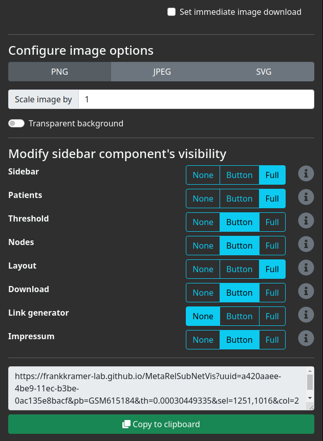

```{r setup, include=FALSE}
knitr::opts_chunk$set(tidy.opts=list(width.cutoff=55,
                                     args.newline = TRUE,
                                     arrow = TRUE),
                      tidy=TRUE)
```

```{r navigation, eval=HTML, results='asis', echo=FALSE}
res <- knitr::knit_child('navigation/navigation.Rmd', quiet = TRUE)
cat(res, sep = '\n')
```

# MetaRelSubNetVis

MetaRelSubNetVis allows the comparison the integrated networks of patients within patient groups with respect to the individuals' contained biological data.
The previously created and to the NDEx uploaded network contains all the necessary information and description of the data attribute.
It is available on NDEx as "Combined patient-specific breast cancer subnetworks" at https://www.ndexbio.org/viewer/networks/a420aaee-4be9-11ec-b3be-0ac135e8bacf

The MetaRelSubNetVis website is available at https://frankkramer-lab.github.io/MetaRelSubNetVis:


With MetaRelSubNetVis we provide a visualization tool that allows users to inspect differences between two groups of patients by directly loading the network from the NDEx platform.
Our previous network is already available as sample network on the website, but NDEx platform can be queried for any other publicly available networks.
Additionaly, the network not only has to be set to be public, but explicitly marked as searchable to be found by the search.

# Network data requirements
To make sure, your network is compatible as input for this class comparison, it has to fulfill the specific properties.

The network needs to conform to the [CX data model](https://home.ndexbio.org/data-model/) (which should already the case if it passed validation on the NDEx platform) and contain the aspects `nodes`, `edges`, `nodeAttributes`, and `networkAttributes`.

## Nodes
Each node has to have an id (property `@id`) and a name (property `n`).

## Edges
Each edge has to have an id (property `@id`), a source (property `s`) and a target (property `t`).

## NodeAttributes
Each node can have multiple attributes. 
A node attribute's relation to a node is indicated by the node attribute's property `po`. 
The name of the node attribute (property `n`) always starts with a patient identifier, followed by `_`. 
After that the attribute is described. 
The following are required for each patient:

- *Score:* Relevance score, a numeric value
- *GE:* Gene expression, a numeric value
- *GE_Level:* Gene expression level, one of the following values: (`LOW`, `HIGH`, `NORMAL`)

Optional attributes are:

- *MTB:* a boolean value

## NetworkAttributes
NetworkAttributes are used to describe the patient samples. Please note: The order within each of these attributes is crucical.

- *Patients:* String list of patient identifiers
- *PatientSubtype:* String list of each patient's cancer subtype
- *PatientSurvivalYears:* Double list of each patient's metastasis free survival
- *PatientGroups:* String list of each patient's group (in sum there can only be two different types of groups!)

Furthermore the property name contains the network's name (property `name`) that will be used as a headline for this application.

# Interactive exploration

Clicking the "Open the app with this network" for the "Combined patient-specific breast cancer subnetworks" will open it in for exploration:


By default all nodes are displayed in a concentric layout.
The graph is interactive, meaning the nodes are draggable and preserve their position, even when the patient selection or visualization parameters change.
The graph can also be zoomed in and moved to adjust the investigation of the content as wanted.

A specific patient can be investigated by selecting one from the metastatic or non-metastatic patients in the patients tab.
For the single available patients their cancer subtype is displayed along their identifier.
Selecting for example the patient GSM615368 with Basal cancer subtype from the metastatic group displays only the relevant genes to this subnetwork.


By default the subnetwork is colored by its gene expression level, and sized by the relevance score.
The results of the molecular tumor board analysis are marked by a green border around the corresponding nodes.
The coloring and sizing of the nodes can easily be adjusted, for example by changing it to gene expression and relevance score respectively.
The displayed nodes can be filtered to lie above a certain threshold.


\newpage

The coloring follows a gradient consistent over the relevance scores of all patients.
It is also notable, that lower values of the relevance score for genes does not necessarily imply the lack of relevance:
the selected genes still represent the top 140 relevant genes.

To display the subnetwork in the context of all genes combined by all patients, it is possible to include those genes within the visualization.
Since not being relevant to this subnetwork, they are displayed in gray.
The adjustment of the threshold (although here reset to include all relevant genes) then still includes otherwise no longer applicable nodes as default gray nodes.


Additionally the available nodes can searched and highlited within the graph.
All the adjacent edges are highlighted as well to put focus on the interaction with the remaining nodes.

Selecting an aditional patient from the non-metastatic group, e.g. GSM615184, as well from the Basal cancer subtype, the relevance scores (or other data if selected) are displayed for both patients in the corresponding half of the node (left for metastatic, right for non-metastatic).
Gene only present in the patient of one group are colored gray for the other group.
The size of the nodes is set to small for nodes only present in one group and double the size when present in both groups to make it easily distinguishable.


However, it is also possible to only display the nodes shared between both patients.


Disselecting the patient from the metastatic group leaves only the remaining patient visualized, here with marked genes `MYC` and `CCND1`.


The visualizations generated by setting the various parameters can easily exported as images in different formats for further use or publication.


The exported image in PNG format with transparent background from the current visualized network then can be included everywhere, even here:


# Sharing the network by visualization link

The results of the data integration with networks, and its visualization are useful information to collaborators.
However, sharing the data needs the receiver to be able to handle the tools for exploration and visualization.
Sharing the visualization only as images omits much of the otherwise included information.

MetaRelSubNetVis combines both to an advanced, but simple to use web-based visualization and exploration tool.
One can generate links for sharing a specific subnetwork including the settings from current visualization.  
Furthermore it is possible to set the options for automatic image download or display of the sidebar and its components.


\newpage

The current visualization is summarized to comprehend and review the current settings.



\newpage

The remaining options can force the rendering of the network visualization and trigger an download dialogue, or determine the behaviour of the exploration panel.
It is possible to set different options for the sidebar and the components:
- *None:* hides the element completely
- *Button* displays the element collapsed 
- *Full* displays the element in expanded form.

The here used options show the sidebar, patients and layout tab expanded, hides the link generator tab, and displays the remaining elements collapsed.

The link to share the current network with the set options and current visualization is as follows:

https://frankkramer-lab.github.io/MetaRelSubNetVis?uuid=a420aaee-4be9-11ec-b3be-0ac135e8bacf&pb=GSM615184&th=0.00030449335&sel=1251,1016&col=2&size=0&all=false&shared=true&mtb=true&sb=0&cP=0&cT=1&cN=1&cL=0&cD=1&cG=2&cIm=1

This link starts the MetaRelSubNetVis app to display the network, and the selected patient the same way as when the link was generated.
The link then can be used to share custom visualization with collaborators to point out certain specifics to discuss.
Furthermore, it can be provided along the image used within a publication to enable the reader additional investigation and exploration of the studied network integration.

With this link, also an interactive visualization of the network can be embedded on a distinct website:

```{r websiteHTML, eval=HTML, results='asis', echo=FALSE}
cat('<div style="height: 50em;"><iframe src="https://frankkramer-lab.github.io/MetaRelSubNetVis?uuid=a420aaee-4be9-11ec-b3be-0ac135e8bacf&pb=GSM615184&th=0.00030449335&sel=1251,1016&col=2&size=0&all=false&shared=true&mtb=true&sb=0&cP=0&cT=1&cN=1&cL=0&cD=1&cG=2&cIm=1" allowfullscreen="" allow="autoplay" data-external="1" style="-webkit-transform:scale(0.5);-moz-transform-scale(0.5);-moz-transform-origin: top left; -webkit-transform-origin: top left; -o-transform-origin: top left; -ms-transform-origin: top left; transform-origin: top left;width: 200%;height: 100em;"></iframe></div>')
```
```{r websitePDF, eval=!HTML, results='asis', echo=FALSE}
cat('')
```


```{r navigation2, eval=HTML, results='asis', echo=FALSE}
res <- knitr::knit_child(HTML_file, quiet = TRUE)
cat(res, sep = '\n')
```
