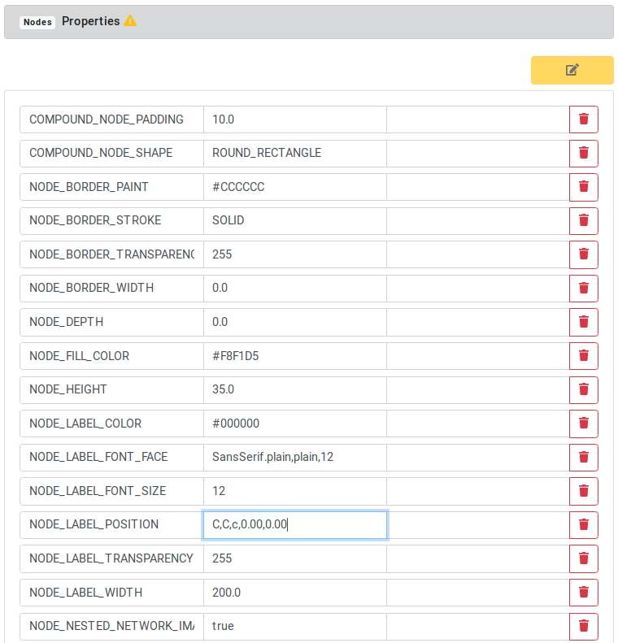
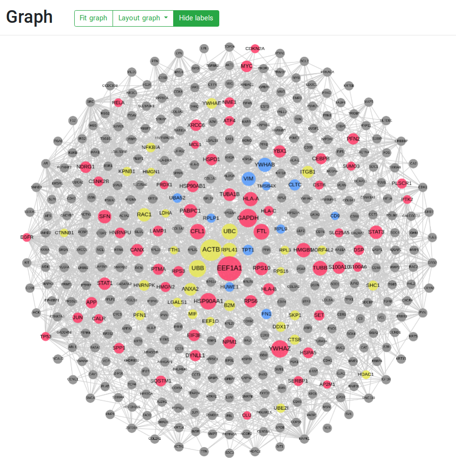

```{r setup, include=FALSE}
knitr::opts_chunk$set(tidy.opts=list(width.cutoff=55,
                                     args.newline = TRUE,
                                     arrow = TRUE),
                      tidy=TRUE)
```

```{r navigation, eval=HTML, results='asis', echo=FALSE}
res <- knitr::knit_child('navigation/navigation.Rmd', quiet = TRUE)
cat(res, sep = '\n')
```


# NDExEdit

NDExEdit allows you to modify a biological network visually in your browser. 
You don't need to create an account or install further software. 
All you need is a browser and a network, that conforms to the [CX data model](https://home.ndexbio.org/data-model/).
NDExEdit is available at 

https://frankkramer-lab.github.io/NDExEdit

NDExEdit is tightly connected to NDEx, a distribution platform specifically designed for biological networks.

One of the most powerful visualization tools in our toolbox are so-called mappings. 
They were introduced by Cytoscape as a manner of applying a network's properties onto its visualization.

A simple workflow with NDExEdit consists of importing your network file, inspect the data foundation and existing visualization, modifying some visual properties and export the network. 
Each of these steps is described in detail below.

# Visualize gene occurances

## Import combined subnetworks

To load a network into NDExEdit there are three options:
- UUID: NDEx assigns unique IDs to all of its networks. If you know that, you can just paste it into the import field and get started.
- Browse NDEx: The built-in browser allows you to look for a network on NDEx from within NDExEdit. To browse your account specific networks, you need to login.
- Local file: If the network you wish to edit is not yet on NDEx, you can upload a local .cx file to work with.

**Please note: A network can only be imported, if it conforms to the CX data model and if its size is acceptable.**

The network is also available on the NDEx platform as "Combined patient-specific breast cancer subnetworks":

https://www.ndexbio.org/viewer/networks/079f4c66-3b77-11ec-b3be-0ac135e8bacf

We could search the network using the option to brows NDEx or simply load the network by its UUID:


\newpage

Once the network is available, open the network to edit its visual styles.
In the beginning all nodes are cluttered together, because the network does neither contain a visualization nor a layout applied.
To achieve the same layout as at the NDEx platform, we can simply apply a circular layout by selecting it from the "Layout graph" option above the graph.


## Create mappings

Firstly create adjust the node labels to be displayed in the center of the nodes instead on to of its.
Again, because the network initially does not contain any visual styles, on loading a default style analogous with the visualization on the NDEx platform is automatically loaded.
Therefore, some properties are already present, which influence the default visual representation of the nodes and edges.
Those default values also apply if attributes used for a mapping are not set for a node or edge (fallback).

To change the default node label position, we switch to the edit tab and click on the yellow edit button right below the node properties to start editing.


There is also a button directly below the nodes chapter to reset all set visual properties to the default values.

The entry responsible for the label position is the `NODE_LABEL_POSITION` property.
Changing the value to `C,C,c,0.00,0.00` sets the label position with its center (first `C`) to the center of the node (second `C`).



\newpage

The yellow symbol next to the node properties subchapter header indicates the properties are in the editing mode, and therefore nothing else can be changed in the meanwhile.
The edit mode only can be left with accepting or canceling the edits.
This applies to any edits of properties or mappings on the page!


Next we will create a continuous mapping based on the number of occurrences of the genes across the different patients (`Occurrence` node attribute).
At the continuous subchapter we start typing the attribute name and select the occurrence, type for example "width" in the style property input box and select the prompted "NODE_WIDTH", and click on the green plus to start defining the mapping.


The distribution of the occurrence values along the node ids is shown in the histogram above to simplify selection of appropriate values.
Since we have 79 patients included, and the node ids start at 1, we define the mapping with these values as limits.
After saving the mapping, we can explore the defined mapping, e.g. the created color gradient.


\newpage

Also the graph is updated immediately after:


\newpage

The network now can be exported in different formats, namely PNG, JPEG, or downloaded as CX file.


\newpage

Additionally, the network can directly uploaded the the NDEx platform when logged in.
The symbol in the upper right indicates the connection status.


# Visualize one patient

Here we create a visualization for one patient equivalent to the visualization generated by MetaRelSubNetVis.
As sample we choose the metastatic patient GSM615368.
We create a visualization based on the relevance score for node and node label size, and gene expression level for node coloring.

First adjust the default node color (property `NODE_FILL_COLOR`) to gray (#888888), and the node label the same as before to the center.
Analogously, we set the default edge color (property `EDGE_UNSELECTED_PAINT`) to a light gray (#cccccc).

Now we create a discrete mapping for the gene expression level.
The different levels `LOW`, `NORMAL`, and `HIGH` should be mapped to blue, yellow and red.

Also we mark the results of the molecular tumor board analysis for this patient by a green border.


Next create the continuous mapping for the node size.
The mapping is limited by the min. value of 0.000298, and the max. value 0.000922 for relevance scores.
The values of the relevance scores for this patient are stored in the node attribute `GSM615368_Score`.


\newpage

The finished network looks as follows:



```{r websiteHTML, eval=HTML, results='asis', echo=FALSE}
cat('<div style="height: 50em;"><iframe src="https://frankkramer-lab.github.io/MetaRelSubNetVis?uuid=a420aaee-4be9-11ec-b3be-0ac135e8bacf&pa=GSM615368&th=0.00029828155&col=0&size=1&all=true&shared=false&mtb=true&sb=2" allowfullscreen="" allow="autoplay" data-external="1" style="-webkit-transform:scale(0.5);-moz-transform-scale(0.5);-moz-transform-origin: top left; -webkit-transform-origin: top left; -o-transform-origin: top left; -ms-transform-origin: top left; transform-origin: top left;width: 200%;height: 100em;"></iframe></div>')
```
```{r websitePDF, eval=!HTML, results='asis', echo=FALSE}
cat('')
```
https://frankkramer-lab.github.io/MetaRelSubNetVis?uuid=a420aaee-4be9-11ec-b3be-0ac135e8bacf&pa=GSM615368&th=0.00029828155&col=0&size=1&all=true&shared=false&mtb=true&sb=2

The only look almost the same due to some difference in the layout algorithm, which mirrors the nodes at the x axis.


```{r navigation2, eval=HTML, results='asis', echo=FALSE}
res <- knitr::knit_child(HTML_file, quiet = TRUE)
cat(res, sep = '\n')
```

# Session info
```{r sessionInfo}
sessionInfo()
```
