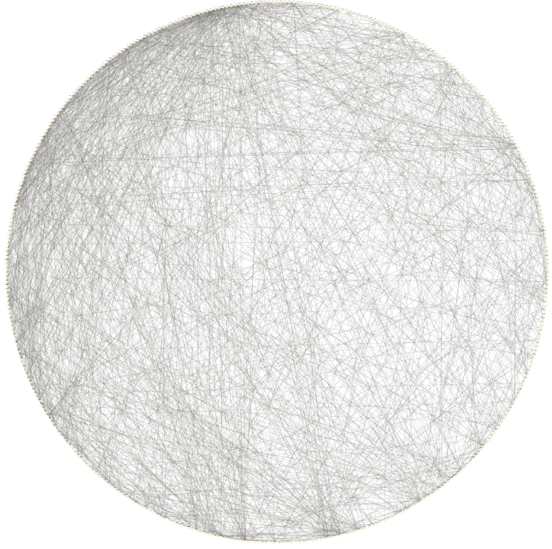
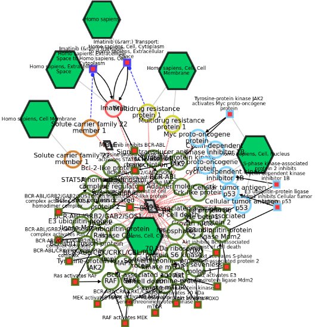

```{r setup, include=FALSE}
knitr::opts_chunk$set(tidy.opts=list(width.cutoff=55,
                                     args.newline = TRUE,
                                     arrow = TRUE),
                      tidy=TRUE)
```

```{r navigation, eval=HTML, results='asis', echo=FALSE}
res <- knitr::knit_child('navigation/navigation.Rmd', quiet = TRUE)
cat(res, sep = '\n')
```

# Setup

## Load libraries

```{r libraries, eval=FALSE}
library(ndexr)
library(RCX)
```

# Load the combined subnetworks

The network is also available on the NDEx platform as "Combined patient-specific breast cancer subnetworks":

https://www.ndexbio.org/viewer/networks/079f4c66-3b77-11ec-b3be-0ac135e8bacf

The R package `ndexr` can be used to download the network from NDEx:

```{r ppiNdexLoad, eval=FALSE}
ndex_con = ndex_connect()
combined_subnetwork_uuid = "a420aaee-4be9-11ec-b3be-0ac135e8bacf"
combined_subnetwork_rcx = ndex_get_network(ndex_con, combined_subnetwork_uuid)
print(combined_subnetwork_rcx$metaData)
```


# Visualization


```{r tmp, eval=F}
visualize(combined_subnetwork_rcx, c(name="circle"))
```



```{r exportRCX, eval=FALSE}
tmp_net = combined_rcx_network

nodeAttributes = tmp_net$nodeAttributes
nodeAttributes = nodeAttributes[nodeAttributes$name %in% c("occurrence","DE"),]

tmp_net$nodeAttributes = nodeAttributes
tmp_net$networkAttributes = createNetworkAttributes(
  name = c("author", 
           "name"),
  value = c("Florian J. Auer",
            "Combined subnetworks of relevant genes of the HPRD-PPI network")
)


distance = 80
catesianLayout = createCartesianLayout(
  tmp_net$nodes$id, 
  x = rep(seq(0,19)*distance,21)[1:length(tmp_net$nodes$id)],
  y = rep(seq(0,20)*distance,each=20)[1:length(tmp_net$nodes$id)]
)
tmp_net = updateCartesianLayout(tmp_net, catesianLayout)

tmp_net = updateCyVisualProperties(
  tmp_net,
  createCyVisualProperties(
    defaultNodes = createCyVisualProperty(
      properties = createCyVisualPropertyProperties(name = "NODE_LABEL_POSITION",value="MIDDLE"),
      mappings = createCyVisualPropertyMappings(
        name=c("NODE_LABEL",
               "NODE_WIDTH", 
               "NODE_HEIGHT",
               "NODE_FILL_COLOR",
               "NODE_LABEL_FONT_SIZE",
               "NODE_BORDER_PAINT",
               "NODE_BORDER_WIDTH"), 
        type=c("PASSTHROUGH", "CONTINUOUS","CONTINUOUS","CONTINUOUS","CONTINUOUS","DISCRETE","DISCRETE"), 
        definition=c("COL=name,T=string", 
                     "COL=occurrence,T=double,L=0=20,E=0=20,G=0=20,OV=0=1,L=1=80,E=1=80,G=1=80,OV=1=79",
                     "COL=occurrence,T=double,L=0=20,E=0=20,G=0=20,OV=0=1,L=1=80,E=1=80,G=1=80,OV=1=79",
                     "COL=occurrence,T=double,L=0=#a4f9aa,E=0=#a4f9aa,G=0=#a4f9aa,OV=0=1,L=1=#4e83fd,E=1=#4e83fd,G=1=#4e83fd,OV=1=79",
                     "COL=occurrence,T=double,L=0=10,E=0=10,G=0=10,OV=0=1,L=1=20,E=1=20,G=1=20,OV=1=79",
                     "COL=DE,T=boolean,K=0=true,V=0=#ff0000", 
                     "COL=DE,T=boolean,K=0=true,V=0=7")
        ),
      dependencies = createCyVisualPropertyDependencies(
        name = c("nodeCustomGraphicsSizeSync","nodeSizeLocked"),
        value = c("true","false")
      )
    ),
    defaultEdges = createCyVisualProperty(
      properties = createCyVisualPropertyProperties(
        name = c("EDGE_PAINT", "EDGE_UNSELECTED_PAINT", "EDGE_TRANSPARENCY"),
        value = c("#000000", "#000000", "80")
        ),
      dependencies = createCyVisualPropertyDependencies(name = "arrowColorMatchesEdge", value = "true")
    )                       
  )
)
tmp_net = updateMetaData(tmp_net)

writeCX(tmp_net, "tmp/CombinedNetworkTmp.cx")
```


```{r exportRCX, eval=FALSE}
network_from_ndexedit = readCX("Combined subnetworks of relevant genes of the HPRD-PPI network.cx")
visualize(network_from_ndexedit)
```


```{r navigation2, eval=HTML, results='asis', echo=FALSE}
res <- knitr::knit_child(HTML_file, quiet = TRUE)
cat(res, sep = '\n')
```

# Session info
```{r sessionInfo}
sessionInfo()
```
