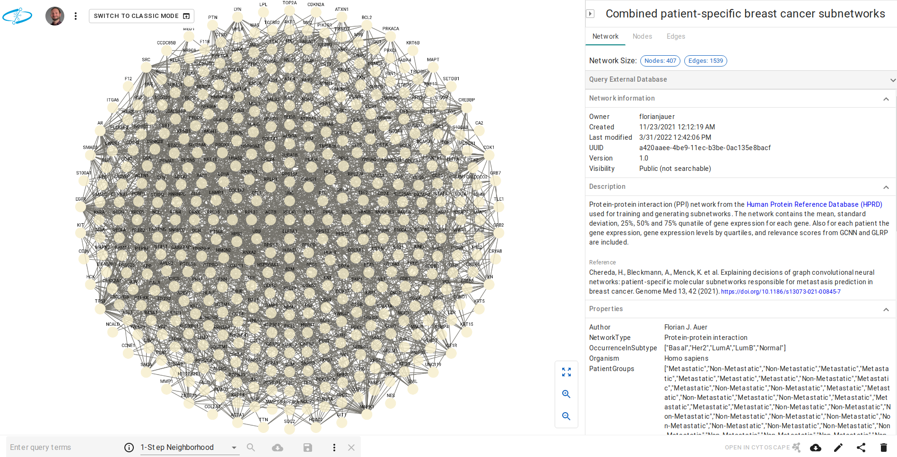
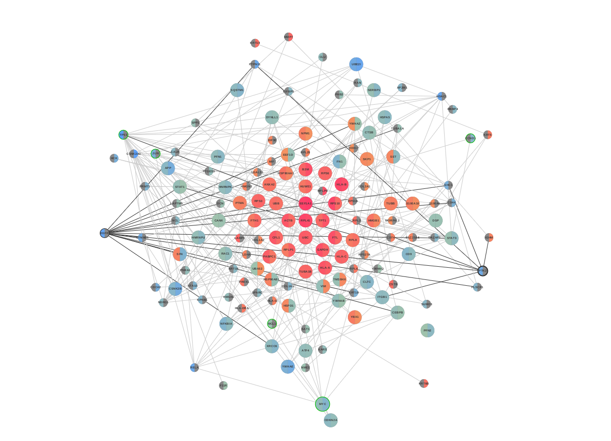

```{r setup, include=FALSE}
knitr::opts_chunk$set(tidy.opts=list(width.cutoff=55,
                                     args.newline = TRUE,
                                     arrow = TRUE),
                      tidy=TRUE)
```

```{r navigation, eval=HTML, results='asis', echo=FALSE}
res <- knitr::knit_child('navigation/navigation.Rmd', quiet = TRUE)
cat(res, sep = '\n')
```

# Overview

The network is also available on the NDEx platform as "Combined patient-specific breast cancer subnetworks":

https://www.ndexbio.org/viewer/networks/079f4c66-3b77-11ec-b3be-0ac135e8bacf

The network does not have any visualization yet.
By default a circular layout is applied to at the NDEx platform to be able to display the network in a way:



In the following chapters different tools will be used to visualize the data and document the performed steps in a reproducible manner.

# [MetaRelSubNetVis](MetaRelSubNetVis.html) 

The web application MetaRelSubNetVis is able to work on the combined network without any preset visualization.
It used the network stored on the NDEx platform to generate linkable and reproducible network visualizations that can be included in other applications.
It visualizes either single patients or comparative visualizations of one patient from each group, namely metastatic and non-metastatic patients.

```{r websiteHTML, eval=HTML, results='asis', echo=FALSE}
cat('<div style="height: 50em;"><iframe src="https://frankkramer-lab.github.io/MetaRelSubNetVis?uuid=a420aaee-4be9-11ec-b3be-0ac135e8bacf&pa=GSM615368&pb=GSM615184&th=0.00029828155&sel=1106,3406&col=1&size=1&all=false&shared=false&mtb=true&sb=2" allowfullscreen="" allow="autoplay" data-external="1" style="-webkit-transform:scale(0.5);-moz-transform-scale(0.5);-moz-transform-origin: top left; -webkit-transform-origin: top left; -o-transform-origin: top left; -ms-transform-origin: top left; transform-origin: top left;width: 200%;height: 100em;"></iframe></div>')
```
```{r websitePDF, eval=!HTML, results='asis', echo=FALSE}
cat('')
```

https://frankkramer-lab.github.io/MetaRelSubNetVis?uuid=a420aaee-4be9-11ec-b3be-0ac135e8bacf&pa=GSM615368&pb=GSM615184&th=0.00029828155&sel=1106,3406&col=1&size=1&all=false&shared=false&mtb=true&sb=2

# [NDExEdit](NDExEdit.html) 

With NDExEdit networks can be loaded from the NDEx platform and visual styles created or modified.
The network data and its distribution can be explored within the web application, and based on this data custom visual properties adjusted.
The created network then can be exported directly back to the NDEx platform or downloaded as file.

# [RCX based](RCXvis.html) 

The RCX package was already used for data preparation and integration, but it also can be used for creating visualizations from within R without the need of additional software.
In this chapter the details of how the visual properties can be created and even visualized with the RCX package.

```{r tmp, eval=F}
visualize(combined_subnetwork_rcx, c(name="circle"))
```


# [Cytoscape and RCy3](CytoscapeAndRCy3.html) 

Cytoscape is one of the most prominent tools for the visualization of biological networks.
It is a java based software that is primarily designed for the interactive application of visual styles.
However, with the package RCy3 Cytoscape can be controlled remotely from within R.
This package can be used to achieve the same visual representation as the tools before.


```{r navigation2, eval=HTML, results='asis', echo=FALSE}
res <- knitr::knit_child(HTML_file, quiet = TRUE)
cat(res, sep = '\n')
```

