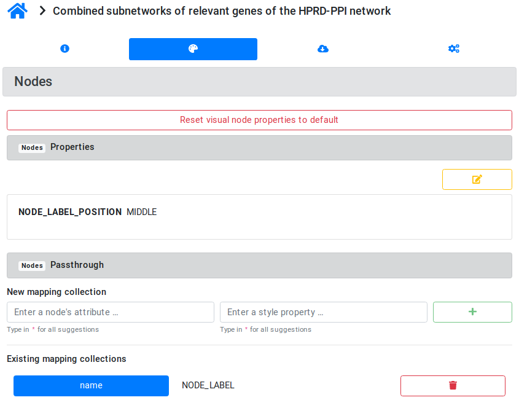
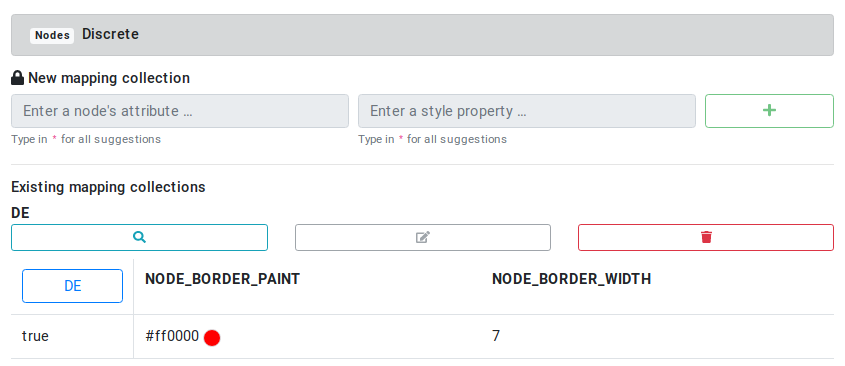
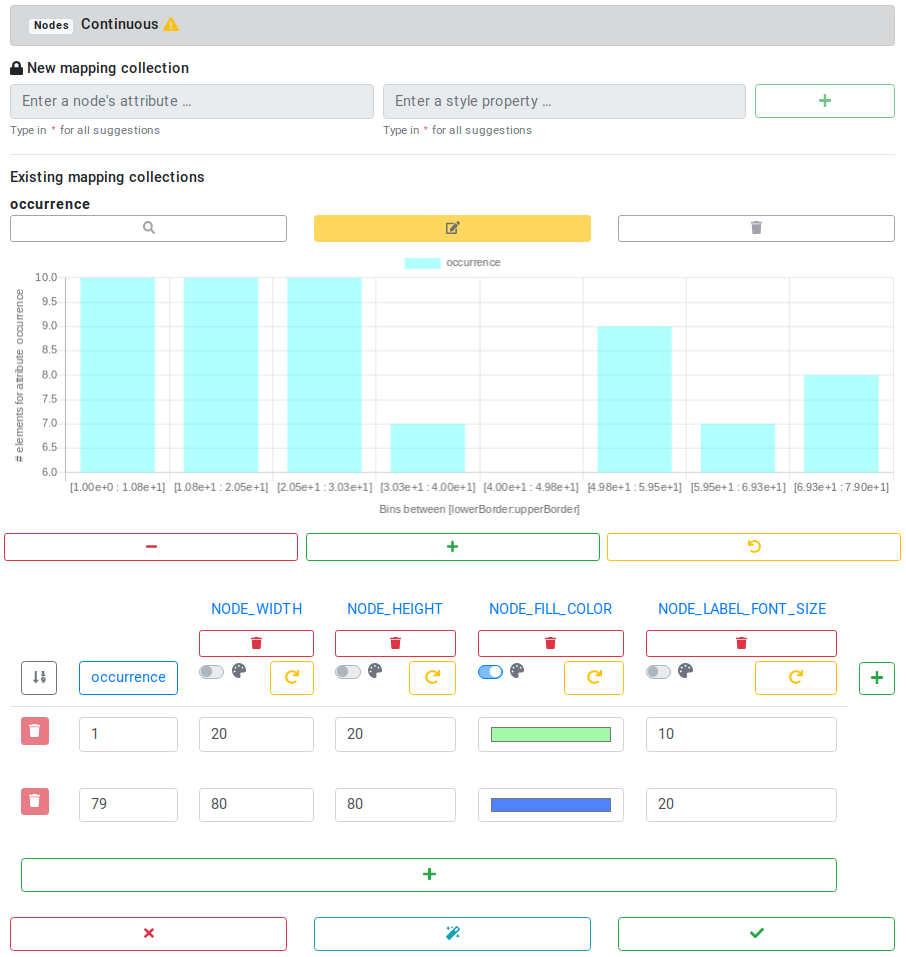
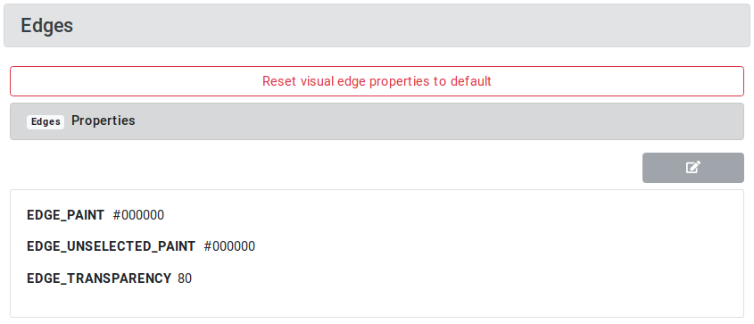
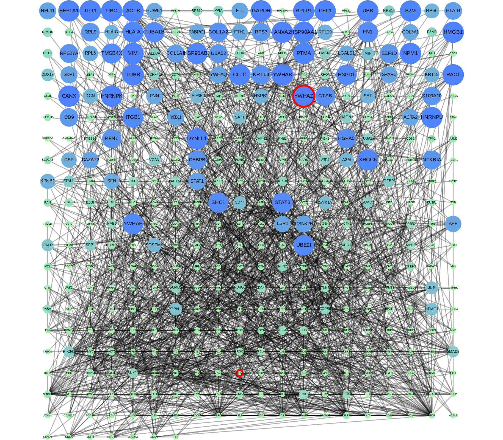

```{r setup, include=FALSE}
knitr::opts_chunk$set(echo = TRUE)
```

Ask Greg:
- how are the 97/79 patients selected from the 969 patients? (how is the train/test set split?)
- patient information of all 969 patients available?
- Where does the HPRD network come from? Last release 2010!

# Install libraries

```{r, eval=FALSE}
devtools::install_github("frankkramer-lab/ndexr", ref="with_RCX")
devtools::install_github("frankkramer-lab/RCX")
if (!requireNamespace("BiocManager", quietly = TRUE))
    install.packages("BiocManager")

BiocManager::install("GEOquery")
```


```{r libraries, eval=FALSE}
library(survival)
library(RColorBrewer)
library(GEOquery)
library(igraph)
library(dplyr)

library(kableExtra)
library(stringr)
library(xtable)
library(pander)
library(timeSeries)
library(devtools)

library(ndexr)
library(RCX)
```
# Data preparation
## Patient information

We applied our methods to a large breast cancer patient dataset that we previously studied and preprocessed [27]. That data is compiled out of 10 public microarray datasets measured on Affymetrix Human Genome HG-U133 Plus 2.0 and HG-U133A arrays. The datasets are available from the Gene Expression Omnibus (GEO) [28] data repository (accession numbers GSE25066, GSE20685, GSE19615, GSE17907, GSE16446, GSE17705, GSE2603, GSE11121, GSE7390, GSE6532). The RMA probe-summary algorithm [29] was used to process each of the datasets, and only samples with metadata on metastasis-free survival were selected and combined together on the basis of HG-U133A array probe names. Quantile normalization was applied over all datasets. In the case of several probes mapping to one gene, only the probe with the highest average value was considered.

The patients were assigned to one of two classes: 393 patients with distant metastasis within the first 5 years and 576 patients without metastasis having the last follow-up between 5 and 10 years. Breast cancer molecular subtypes for the patient samples were predicted in [27] utilizing genefu R-package [30].


The constant of labels_GEO_HG.csv

1) People who had metastatic event during the first 0-5 years (correspond to "1"). 393 patients.

2) People who did not have metastatic event during the first five years and who had the last follow up between 5 and 10 years. No metastatic events at all. This class corresponds to "0". 576 patients.

We retrained the Graph-CNN on 872 patients and generated relevances for **97 test patients**.

**It is not stated which patients those 97 patients are!!!**
Use own information

Load the patient information about the 97 patients:

```{r patientsLoad}
patients = read.csv("data/patient_information.csv", stringsAsFactors=F)
head(patients)
table(patients[,c("subtype","met.event")])
```

There is a difference between labeled and predicted metastatic event.
Therefore the patients are filtered for only correctly predicted metastatic events:

```{r patientsClean}
## Check colnames
colnames(patients) = gsub("Patient.ID", "geo_accession", colnames(patients))
colnames(patients) = gsub("Predicted", "predicted", colnames(patients))
# colnames(patients) = gsub("Concordance", "concordance", colnames(patients))

## Only select patients, that are correctly classified
patients = patients[patients$Concordance == 1, ]
patients$Concordance = NULL
patients = patients[order(patients$subtype),]

## differentiate between the two groups
selMetastatic = patients$met.event == 1

head(patients)
```


Survival by subtype:
Load the necessary libraries:
```{r librariesPatientSurvival}
library(survival)
library(RColorBrewer)
```


```{r patientsSurvival}
fit1 <- survfit(Surv(mfs.years, met.event) ~ subtype, data=patients)
print(fit1)

colors = brewer.pal(5, "Dark2")
names(colors) = c("Basal", "Her2", "LumA", "LumB", "Normal")

plot(fit1, col=colors, lwd=2, mark.time=TRUE, xlab="Years since study entry", ylab="Survival")
legend("bottomleft", names(colors), col=colors, lwd=2, bty='n')
```


## Gene expression

Gene expression of the whole data set:

```{r geLoad}
ge_all = read.csv("data/greg_pub/GEO_HG_PPI.csv", stringsAsFactors=F)
```

Get the mean, standard deviation and boundaries for the 25% and 75% quantile for each gene (probe) based on its expression in all patients.
```{r geLibraries, message=FALSE}
library(dplyr)
```

```{r geColumns}
ge_gene_col = "probe"
ge_patient_cols = colnames(ge_all)[colnames(ge_all) != ge_gene_col]
```

```{r geStatistics, eval=FALSE}
ge_gene_col = "probe"
ge_patient_cols = colnames(ge_all)[colnames(ge_all) != ge_gene_col]

ge_with_statistics = ge_all %>%
  rowwise() %>%
  do({
    curRow = unlist(.[ge_patient_cols])
    result = data.frame(., stringsAsFactors = F)
    result["mean"] = mean(curRow)
    result["stdev"] = sd(curRow)
    quartiles = quantile(curRow, probs = c(0.0, 0.25, 0.4, 0.5, 0.6, 0.75, 1.0))
    result["Q25"] = quartiles['25%']
    result["Q50"] = quartiles['50%']
    result["Q75"] = quartiles['75%']
    result
  })

print(unique(gsub("GSM[0-9]+","GSM...",colnames(ge_with_statistics))))
```
```{r geStatisticsSave, eval=FALSE, include=FALSE}
write.csv(ge_with_statistics, file = "tmp/ge_with_statistics.csv", row.names = FALSE)
```

```{r geStatisticsLoad, include=FALSE}
ge_with_statistics = read.csv(file = "tmp/ge_with_statistics.csv")
print(unique(gsub("GSM[0-9]+","GSM...",colnames(ge_with_statistics))))
```

This data can be used to calculate the expression level of a gene (LOW, NORMAL or HIGH) using quartile boundaries.

```{r geLevels, eval=FALSE}
ge_expression_level_by_quantiles = ge_with_statistics %>%
    rowwise() %>%
    do({
      curRow = unlist(.[ge_patient_cols])
      l = unlist(.["Q25"])
      h = unlist(.["Q75"])
      
      curRow[ge_patient_cols] = ifelse(curRow < l, "LOW",
                                    ifelse(curRow > h, "HIGH",
                                           "NORMAL"))
      curRow = c(unlist(.[ge_gene_col]), curRow)
      result = as.data.frame(t(curRow), stringsAsFactors=F)
      result
    })

print(unique(gsub("GSM[0-9]+","GSM...",colnames(ge_expression_level_by_quantiles))))
```

```{r geLevelsSave, eval=FALSE, include=FALSE}
write.csv(ge_expression_level_by_quantiles, file = "tmp/ge_expression_level_by_quantiles.csv", row.names = FALSE)
```

```{r geLevelsLoad, include=FALSE}
ge_expression_level_by_quantiles = read.csv(file = "tmp/ge_expression_level_by_quantiles.csv")
print(unique(gsub("GSM[0-9]+","GSM...",colnames(ge_expression_level_by_quantiles))))
```

Get the gene expression only for the patients and order patients by subtype

```{r geOrder}
ge_patients = ge_all[,patients$geo_accession[order(patients$subtype)]]
rownames(ge_patients) = ge_all$probe
```

Check the gene expression data to be normalized, therefore make a boxplot of the expression data:

```{r geBoxplot}
boxColors = sapply(colnames(ge_patients), function(x){
 subtype = patients$subtype[patients$geo_accession == x]
 return(colors[subtype])
})

boxplot(ge_patients, col=boxColors)
par(xpd=TRUE)
legend("topright", legend = names(colors) , 
    col = colors , bty = "o", pch=20 , pt.cex = 3, cex = 1, horiz = FALSE, inset = c(0.03, 0.1))
```


### Differential gene expression


#### Hierarchichal Clustering

Clustering is an unsupervised learning method, which groups data points based on similarity, and is used to reveal the underlying structure of data. In quality control settings, we use hierarchical clustering, and, for that, we need to decide which distance measure and linkage algorithms to use. 

```{r geCluster, eval=FALSE, include=FALSE}
## Distance mesures
ddd.c=as.dist(1-cor(ge_patients)) # Correlation
ddd.m=dist(t(as.matrix(ge_patients)), method = "manhattan")
ddd.e=dist(t(as.matrix(ge_patients)), method = "euclidean")

## Linkage and Hierachichal clusterinh (hclust function)
dend.c.c=hclust(ddd.c, method= "complete")
dend.c.a=hclust(ddd.c, method= "average")
dend.c.s=hclust(ddd.c, method= "single")

dend.m.c=hclust(ddd.m, method= "complete")
dend.m.a=hclust(ddd.m, method= "average")
dend.m.s=hclust(ddd.m, method= "single")

dend.e.c=hclust(ddd.e, method= "complete")
dend.e.a=hclust(ddd.e, method= "average")
dend.e.s=hclust(ddd.e, method= "single")

```

To assess whether the main source of variability of the data is biological or technical, we can plot the dendrograms.

```{r geDend, eval=FALSE, include=FALSE}
labelCol <- function(x) {
  if (is.leaf(x)) {
    label <- attr(x, "label")
    meta = correct_patients$label[correct_patients$geo_accession == label]
    attr(x, "nodePar") <- list(lab.col=ifelse(meta==1, "red", "black"))
  }
  return(x)
}

par(cex=0.5)
plot(dendrapply(as.dendrogram(dend.c.c), labelCol), main = "dend.c.c")
plot(dendrapply(as.dendrogram(dend.c.a), labelCol), main = "dend.c.a")
plot(dendrapply(as.dendrogram(dend.c.s), labelCol), main = "dend.c.s")

plot(dendrapply(as.dendrogram(dend.m.c), labelCol), main = "dend.m.c")
plot(dendrapply(as.dendrogram(dend.m.a), labelCol), main = "dend.m.a")
plot(dendrapply(as.dendrogram(dend.m.s), labelCol), main = "dend.m.s")

plot(dendrapply(as.dendrogram(dend.e.c), labelCol), main = "dend.e.c")
plot(dendrapply(as.dendrogram(dend.e.a), labelCol), main = "dend.e.a")
plot(dendrapply(as.dendrogram(dend.e.s), labelCol), main = "dend.e.s")

```

t-test

```{r}
## perform a t-test for each gene
ttest = apply(ge_patients, 1, function(x){
 res = t.test(x[selMetastatic],
              y=x[!selMetastatic])
 return(res$p.value)
})

## adjust for multiple testing
de = data.frame(
 prope=names(ttest), 
 pvalue=ttest, 
 qvalue = p.adjust(ttest)
)

## re-order by q-value
de = de[order(de$qvalue),]

## select differentially expressed genes
de_genes = de$prope[de$qvalue < 0.01]
de[de_genes,]
```

### Heatmap visualization

A heatmap is a graphical representation of data where the individual values contained in a matrix are represented as colors. Now that we have a subset of DE genes, we can use their counts to generate a heatmap. We expect DE genes to be able to separete the samples from different groups into different clusters of the dendrograms.

```{r heatmapLibraries, message=FALSE}
library(gplots)
```

```{r}
# colors
pal=brewer.pal(9, "RdYlBu")

# heatmap
heatmap.2(
  as.matrix(ge_patients[de_genes,]) , 
  dist=function(x) {as.dist(1-cor(t(x)))}, 
  scale="row",  
  col=pal, 
  colCol = boxColors,
  ColSideColors = ifelse(patients$met.event == 1, "red", "black"),  
  trace="none", 
  cexRow=1, 
  cexCol=0.5,
  dendrogram = "column"
)

## legend
par(xpd=TRUE)

## non-/metastatic
legend("topleft", 
       legend = c("metastatic", "non-metastatic") , 
       col = c("red", "black") , 
       bty = "o", pch=20 , pt.cex = 3, cex = 1, horiz = FALSE, inset=c(-0.1,0.25))
## subtypes
legend("bottomleft", 
       legend = names(colors) , 
       col = colors , 
       bty = "o", pch=20 , pt.cex = 3, cex = 1, horiz = FALSE, inset=c(-0.1,-0.27))
```


## Relevance score

Paper supplement:

```{r relevanceLoad, eval=FALSE, include=FALSE}
ppi_relevance_score = readRDS("data/ppi_relevance_score.data.frame.RDS")
pp_tmp = ppi_relevance_score
tmp_pat = pp_tmp$`Patient ID`
pp_tmp$`Patient ID` = NULL
tmp_gene = colnames(pp_tmp)
ppi_relevance_score = as.data.frame(t(pp_tmp))
colnames(ppi_relevance_score) = tmp_pat

ppi_relevance_score$probe = rownames(ppi_relevance_score)
write.csv(ppi_relevance_score, file = "data/ppi_relevance_score.csv", row.names = FALSE)
```


```{r relevanceLoad}
relevance_score = read.csv("data/ppi_relevance_score.csv")
print(unique(gsub("GSM[0-9]+","GSM...",colnames(relevance_score))))
```

## PPI networks

We used the Human Protein Reference Database (HPRD) protein-protein interaction (PPI) network [26] as the molecular network to structure the gene expression data. The database contains protein-protein interaction information based on yeast two-hybrid analysis, in vitro and in vivo methods. The PPI network is an undirected graph with binary interactions between pairs of proteins. The graph is not connected.

[26] Keshava Prasad TS, Goel R, Kandasamy K, Keerthikumar S, Kumar S, Mathivanan S, Telikicherla D, Raju R, Shafreen B, Venugopal A, Balakrishnan L, Marimuthu A, Banerjee S, Somanathan DS, Sebastian A, Rani S, Ray S, Harrys Kishore CJ, Kanth S, Ahmed M, Kashyap MK, Mohmood R, Ramachandra YL, Krishna V, Rahiman BA, Mohan S, Ranganathan P, Ramabadran S, Chaerkady R, Pandey A. Human protein reference database?2009 update. Nucleic Acids Res. 2009; 37:767–72. https://doi.org/10.1093/nar/gkn892.

From website http://hprd.org/
Latest release: Apr 13, 2010

```{r ppiLibraries, message=FALSE}
library(igraph)
```

From publication:
```{r ppiLoad}
ppi_network_matrix = read.csv("data/greg_pub/HPRD_PPI.csv", check.names = FALSE)
ppi_network_igraph = graph_from_adjacency_matrix(as.matrix(ppi_network_matrix), mode = "undirected")

gorder(ppi_network_igraph)
```

Remove multiple edges and loops from one node to itself from the network.

```{r ppiIgraph}
ppi_network_igraph = simplify(ppi_network_igraph, 
                              remove.multiple = T, 
                              remove.loops = T)

gorder(ppi_network_igraph)
gsize(ppi_network_igraph)
```

Prepare the igraph network for converting to RCX, therefore IDs have to be set for nodes and edges.
The CX convention is, in contrast to R, that the IDs start at 0.

```{r ppiAddIds}
V(ppi_network_igraph)$id = seq(0,gorder(ppi_network_igraph)-1)
E(ppi_network_igraph)$id = seq(0,gsize(ppi_network_igraph)-1)
```

For the conversion, the vertex attribute containing the node names has to be specified.
```{r rcxLibraries, message=FALSE}
library(RCX)
```


```{r ppiToRCX}
ppi_network_rcx = fromIgraph(ppi_network_igraph, nodeName = "name")
ppi_network_rcx$metaData
```

Add some information to the network

```{r rcxNetworkAttributes}
networkAttributes = createNetworkAttributes(
  name = c("author", 
           "name",
           "description",
           "reference",
           "organism",
           "networkType"),
  value = c("Florian J. Auer",
            "Human Protein Reference Database (HPRD) PPI network",
            'Protein-protein interaction (PPI) network from the <a href="http://hprd.org/" target="_blank">Human Protein Reference Database (HPRD)</a> used for training and generating subnetworks',
            'Chereda, H., Bleckmann, A., Menck, K. et al. Explaining decisions of graph convolutional neural networks: patient-specific molecular subnetworks responsible for metastasis prediction in breast cancer. Genome Med 13, 42 (2021). <a href="https://doi.org/10.1186/s13073-021-00845-7" target="_blank">https://doi.org/10.1186/s13073-021-00845-7</a>',
            "Homo sapiens",
            "Protein-protein interaction")
)
ppi_network_rcx = updateNetworkAttributes(ppi_network_rcx, networkAttributes)

ppi_network_rcx$metaData
```

```{r ppi_load, eval=FALSE, include=FALSE}
writeCX(ppi_network_rcx, "tmp/HPRD-PPI.cx")
```

### Load from NDEx:

```{r rcxLibraries, message=FALSE}
library(ndexr)
```

The network is also available on the NDEx platform:

https://www.ndexbio.org/viewer/networks/079f4c66-3b77-11ec-b3be-0ac135e8bacf

The R package `ndexr` can be used to download the network from NDEx:

```{r ppiNdex}
ndex_con = ndex_connect()
ndexHPRD = ndex_find_networks(ndex_con, "HPRD AND owner:florianjauer")

print(ndexHPRD[c("name", "owner", "externalId", "nodeCount", "edgeCount")])
```


```{r ppiNdexLoad}
ppi_network_rcx = ndex_get_network(ndex_con, "079f4c66-3b77-11ec-b3be-0ac135e8bacf")
ppi_network_rcx$metaData
ppi_network_rcx$networkAttributes$name
```
NDEx added automatically the version to the network attributes.

# Data integration

Firstly, update the network information:

```{r rcxUpdateNetworkAttributes}
ppi_integrated_network_rcx = ppi_network_rcx

networkAttributes = createNetworkAttributes(
  name = c("name",
           "sourceNetwork",
           "description"),
  value = c("Integrated PPI network from HPRD with breast cancer gene expression from GEO",
            "079f4c66-3b77-11ec-b3be-0ac135e8bacf",
            'Protein-protein interaction (PPI) network from the <a href="http://hprd.org/" target="_blank">Human Protein Reference Database (HPRD)</a> used for training and generating subnetworks. The network contains the mean, standard deviation, 25%, 50% and 75% qunatile of gene expression for each gene. Also for each patient the gene expression, gene expression levels by quartiles, and relevance scores from GCNN and GLRP are included.')
)
ppi_integrated_network_rcx = updateNetworkAttributes(
  ppi_integrated_network_rcx, 
  networkAttributes, 
  replace = TRUE
)
```

Adding patient information to the network attributes

```{r rcxPatientInfo}
networkAttributes = createNetworkAttributes(
  name = c("MetastaticPatients", 
           "NonMetatstaticPatients", 
           "MetastaticPatientsSubtype", 
           "NonMetatstaticPatientsSubtype",
           "MetastaticPatientsMfsYears", 
           "NonMetatstaticPatientsMfsYears"),
  value = list(patients$geo_accession[selMetastatic], 
               patients$geo_accession[!selMetastatic],
               patients$subtype[selMetastatic], 
               patients$subtype[!selMetastatic],
               patients$mfs.years[selMetastatic], 
               patients$mfs.years[!selMetastatic])
)
ppi_integrated_network_rcx = updateNetworkAttributes(
  ppi_integrated_network_rcx, 
  networkAttributes
)

ppi_integrated_network_rcx$metaData
```

Now include the relevance scores, gene expression and gene expression levels in the network for all 79 patients.
Also include the gene expression statistics, namely mean, standard deviation and 25%, 50% and 75% quantiles.

**Note: this will take a while**

```{r rcxNodeAttributesData, eval=FALSE}
for (patientId in patients$geo_accession) {
  cat(paste0("Adding node attributes for patient ", patientId, "."))
  # add score as attribute to the nodes
  sel_nodes = match(ppi_integrated_network_rcx$nodes$name, relevance_score$probe)
  nodeAttributes = createNodeAttributes(
    propertyOf = ppi_integrated_network_rcx$nodes$id, 
    name = rep(paste0(patientId,"_score"), length(sel_nodes)),
    value = relevance_score[sel_nodes, patientId]
  )
  ppi_integrated_network_rcx = updateNodeAttributes(ppi_integrated_network_rcx, nodeAttributes)
  
  cat(".")
  # add gene expression as attribute to the nodes
  sel_nodes = match(ppi_integrated_network_rcx$nodes$name, rownames(ge_patients))
  nodeAttributes = createNodeAttributes(
    propertyOf = ppi_integrated_network_rcx$nodes$id, 
    name = rep(paste0(patientId,"_ge"), length(sel_nodes)),
    value = ge_patients[sel_nodes, patientId]
  )
  ppi_integrated_network_rcx = updateNodeAttributes(ppi_integrated_network_rcx, nodeAttributes)

  cat(".")
  # add gene expression level as attribute to the nodes
  sel_nodes = match(ppi_integrated_network_rcx$nodes$name, ge_expression_level_by_quantiles$probe)
  nodeAttributes = createNodeAttributes(
    propertyOf = ppi_integrated_network_rcx$nodes$id, 
    name = rep(paste0(patientId,"_level"), length(sel_nodes)),
    value = ge_expression_level_by_quantiles[sel_nodes, patientId]
  )
  ppi_integrated_network_rcx = updateNodeAttributes(ppi_integrated_network_rcx, nodeAttributes)
  cat("done\n")
}

## include gene expression statistics
## mean
sel_nodes = match(ppi_integrated_network_rcx$nodes$name, ge_with_statistics$probe)
ppi_integrated_network_rcx = updateNodeAttributes(
  ppi_integrated_network_rcx, 
  createNodeAttributes(
    propertyOf = ppi_integrated_network_rcx$nodes$id, 
    name = rep("mean", length(sel_nodes)),
    value = ge_with_statistics[sel_nodes, "mean"]
  )
)

## standard deviation
ppi_integrated_network_rcx = updateNodeAttributes(
  ppi_integrated_network_rcx, 
  createNodeAttributes(
    propertyOf = ppi_integrated_network_rcx$nodes$id, 
    name = rep("stdev", length(sel_nodes)),
    value = ge_with_statistics[sel_nodes, "stdev"]
  )
)

## 25% quantile
ppi_integrated_network_rcx = updateNodeAttributes(
  ppi_integrated_network_rcx, 
  createNodeAttributes(
    propertyOf = ppi_integrated_network_rcx$nodes$id, 
    name = rep("Q25", length(sel_nodes)),
    value = ge_with_statistics[sel_nodes, "Q25"]
  )
)

## 50% quantile
ppi_integrated_network_rcx = updateNodeAttributes(
  ppi_integrated_network_rcx, 
  createNodeAttributes(
    propertyOf = ppi_integrated_network_rcx$nodes$id, 
    name = rep("Q50", length(sel_nodes)),
    value = ge_with_statistics[sel_nodes, "Q50"]
  )
)

## 75% quantile
ppi_integrated_network_rcx = updateNodeAttributes(
  ppi_integrated_network_rcx, 
  createNodeAttributes(
    propertyOf = ppi_integrated_network_rcx$nodes$id, 
    name = rep("Q75", length(sel_nodes)),
    value = ge_with_statistics[sel_nodes, "Q75"]
  )
)

cat("Node attributes:\n")
unique(ppi_integrated_network_rcx$nodeAttributes$name)
```


```{r rcxNodeAttributesData, eval=FALSE, include=FALSE}
## Same as above, but faster
ppi_integrated_network_rcx = ppi_network_rcx
tmp_rel_po = c()
tmp_rel_n = c()
tmp_rel_v = c()

tmp_ge_po = c()
tmp_ge_n = c()
tmp_ge_v = c()

tmp_level_po = c()
tmp_level_n = c()
tmp_level_v = c()

for (patientId in patients$geo_accession) {
  cat(paste0("Adding node attributes for patient ", patientId, "."))
  # add score as attribute to the nodes
  sel_nodes = match(ppi_integrated_network_rcx$nodes$name, relevance_score$probe)
    tmp_rel_po = c(tmp_rel_po, ppi_integrated_network_rcx$nodes$id)
    tmp_rel_n = c(tmp_rel_n, rep(paste0(patientId,"_score"), length(sel_nodes)))
    tmp_rel_v = c(tmp_rel_v, relevance_score[sel_nodes, patientId])
  cat(".")
  # add gene expression as attribute to the nodes
  sel_nodes = match(ppi_integrated_network_rcx$nodes$name, rownames(ge_patients))
    tmp_ge_po = c(tmp_ge_po, ppi_integrated_network_rcx$nodes$id)
    tmp_ge_n = c(tmp_ge_n, rep(paste0(patientId,"_ge"), length(sel_nodes)))
    tmp_ge_v = c(tmp_ge_v, ge_patients[sel_nodes, patientId])
  cat(".")
  # add gene expression level as attribute to the nodes
  sel_nodes = match(ppi_integrated_network_rcx$nodes$name, ge_expression_level_by_quantiles$probe)
    tmp_level_po = c(tmp_level_po, ppi_integrated_network_rcx$nodes$id)
    tmp_level_n = c(tmp_level_n, rep(paste0(patientId,"_level"), length(sel_nodes)))
    tmp_level_v = c(tmp_level_v, ge_expression_level_by_quantiles[sel_nodes, patientId])
  cat("done\n")
}

ppi_integrated_network_rcx = updateNodeAttributes(
  ppi_integrated_network_rcx, 
  createNodeAttributes(
    propertyOf = tmp_rel_po, 
    name = tmp_rel_n,
    value = tmp_rel_v
  )
)

ppi_integrated_network_rcx = updateNodeAttributes(
  ppi_integrated_network_rcx, 
  createNodeAttributes(
    propertyOf = tmp_ge_po, 
    name = tmp_ge_n,
    value = tmp_ge_v
  )
)

ppi_integrated_network_rcx = updateNodeAttributes(
  ppi_integrated_network_rcx, 
  createNodeAttributes(
    propertyOf = tmp_level_po, 
    name = tmp_level_n,
    value = tmp_level_v
  )
)

sel_nodes = match(ppi_integrated_network_rcx$nodes$name, ge_with_statistics$probe)
ppi_integrated_network_rcx = updateNodeAttributes(
  ppi_integrated_network_rcx, 
  createNodeAttributes(
    propertyOf = ppi_integrated_network_rcx$nodes$id, 
    name = rep("mean", length(sel_nodes)),
    value = ge_with_statistics[sel_nodes, "mean"]
  )
)

ppi_integrated_network_rcx = updateNodeAttributes(
  ppi_integrated_network_rcx, 
  createNodeAttributes(
    propertyOf = ppi_integrated_network_rcx$nodes$id, 
    name = rep("stdev", length(sel_nodes)),
    value = ge_with_statistics[sel_nodes, "stdev"]
  )
)

ppi_integrated_network_rcx = updateNodeAttributes(
  ppi_integrated_network_rcx, 
  createNodeAttributes(
    propertyOf = ppi_integrated_network_rcx$nodes$id, 
    name = rep("Q25", length(sel_nodes)),
    value = ge_with_statistics[sel_nodes, "Q25"]
  )
)

ppi_integrated_network_rcx = updateNodeAttributes(
  ppi_integrated_network_rcx, 
  createNodeAttributes(
    propertyOf = ppi_integrated_network_rcx$nodes$id, 
    name = rep("Q50", length(sel_nodes)),
    value = ge_with_statistics[sel_nodes, "Q50"]
  )
)

ppi_integrated_network_rcx = updateNodeAttributes(
  ppi_integrated_network_rcx, 
  createNodeAttributes(
    propertyOf = ppi_integrated_network_rcx$nodes$id, 
    name = rep("Q75", length(sel_nodes)),
    value = ge_with_statistics[sel_nodes, "Q75"]
  )
)

cat("Node attributes:\n")
unique(ppi_integrated_network_rcx$nodeAttributes$name)
```


```{r rcxIntegratedSave, eval=FALSE, include=FALSE}
## Save the data
writeCX(ppi_integrated_network_rcx, "tmp/ppi_integrated_network_rcx.cx")
saveRDS(ppi_integrated_network_rcx, "tmp/ppi_integrated_network_rcx.RDS")
```

```{r rcxIntegratedLoad, include=FALSE}
ppi_integrated_network_rcx = readRDS("tmp/ppi_integrated_network_rcx.RDS")
## produce same output as for creation
for (patientId in patients$geo_accession) {
  cat(paste0("Adding node attributes for patient ", patientId, "...done\n"))
}
cat("Node attributes:\n")
unique(ppi_integrated_network_rcx$nodeAttributes$name)
```

The PPI network with integrated data is also available on NDEx, so the above time consuming integration steps don't have to be repeated every time:

```{r ppiIntegratedNDExLoad, eval=FALSE}
ppi_network_rcx = ndex_get_network(ndex_con, "833b1cee-42f6-11ec-b3be-0ac135e8bacf")
```

# Creation of subnetworks

The subnetworks are created based on the top 140 most relevant genes for each patient.
To get the 140 most relevant genes for each patient, first lets find out the least relevance score of the top 140 genes (i. e. threshold) for every patient:

```{r getThreshold}
topNr=140

thresholds = sapply(patients$geo_accession, function(patientId){
  ## get the scores for one patient
  ## column names of relevance score = gene ids + patientIdCol
  score = as.numeric(relevance_score[,patientId])
  
  ## check if there are less genes than topNr
  topNr = ifelse(length(score) > topNr,
                 topNr,
                 length(score))
  ## return the score at topNr (=threshold)
  return(sort(score, decreasing = TRUE)[topNr])
})

thresholds
boxplot(thresholds, horizontal = TRUE)
```

Now get the relevant genes for all patients

```{r getSubgraph}
relevant_genes = lapply(patients$geo_accession, function(patientId){
  # get the only the scores for a patient
  score = relevance_score[,patientId]
  
  # Filter genes with threshold for patient
  sel_scores = score >= thresholds[patientId]
  # The genes are the column names
  rel_genes = relevance_score$probe[sel_scores]
  
  return(rel_genes)
})

names(relevant_genes) = patients$geo_accession

print(sapply(relevant_genes, length))
```
The helping function to generate subnetwork and remove isolate nodes, and corresponding edges

```{r getRelevantGenes}
relevant_genes = lapply(relevant_genes, function(rel_genes){
  tmp_nodes = ppi_integrated_network_rcx$nodes
  tmp_edges = ppi_integrated_network_rcx$edges
  
  ## select node in the subnetwork
  sel_nodes = tmp_nodes$name %in% rel_genes
  tmp_nodes = tmp_nodes[sel_nodes,]
  
  ## select edges that start AND end in the selected nodes
  sel_edges = tmp_edges$source %in% tmp_nodes$id & tmp_edges$target %in% tmp_nodes$id
  tmp_edges = tmp_edges[sel_edges,]
  
  ## remove isolate nodes
  sel_nodes = tmp_nodes$id %in% tmp_edges$source | tmp_nodes$id %in% tmp_edges$target
  tmp_nodes = tmp_nodes[sel_nodes,]
  return(tmp_nodes$name)
})

print(sapply(relevant_genes, length))

cat("Number of total relevant genes:\n")
length(unique(unlist(relevant_genes)))
```

```{r getCombinedSubnetwork}
big_subnetwork = ppi_integrated_network_rcx

all_rel_genes = unique(unlist(relevant_genes))

tmp_nodes = big_subnetwork$nodes
tmp_edges = big_subnetwork$edges

## select node in the subnetwork
sel_nodes = tmp_nodes$name %in% all_rel_genes
tmp_nodes = tmp_nodes[sel_nodes,]

## select edges that start AND end in the selected nodes
sel_edges = tmp_edges$source %in% tmp_nodes$id & tmp_edges$target %in% tmp_nodes$id
tmp_edges = tmp_edges[sel_edges,]

big_subnetwork$nodes = tmp_nodes
big_subnetwork$edges = tmp_edges

## remove all attributes not included in the nodes
big_subnetwork$nodeAttributes = big_subnetwork$nodeAttributes[
  big_subnetwork$nodeAttributes$propertyOf %in% big_subnetwork$nodes$id,
]

for(patientId in names(relevant_genes)){
  ## get ids of relevant genes for patients
  rel_gene_ids = big_subnetwork$nodes$id[
    big_subnetwork$nodes$name %in% relevant_genes[[patientId]]
  ]
  
  ## select node attributes relevant for patient
  sel_node_attr = startsWith(big_subnetwork$nodeAttributes$name, patientId)
  keep_node_attr = big_subnetwork$nodeAttributes$propertyOf %in% rel_gene_ids
  remove_node_attr = sel_node_attr & !keep_node_attr
  
  big_subnetwork$nodeAttributes = big_subnetwork$nodeAttributes[!remove_node_attr,]
}

big_subnetwork = updateMetaData(big_subnetwork)

big_subnetwork$metaData
```


```{r getSubnetworks}
subnetworks = lapply(names(relevant_genes), function(patientId){
  rel_genes = relevant_genes[[patientId]]
  
  subnet = big_subnetwork
  
  tmp_nodes = ppi_integrated_network_rcx$nodes
  tmp_edges = ppi_integrated_network_rcx$edges
  
  ## select node in the subnetwork
  sel_nodes = tmp_nodes$name %in% rel_genes
  tmp_nodes = tmp_nodes[sel_nodes,]
  
  ## select edges that start AND end in the selected nodes
  sel_edges = tmp_edges$source %in% tmp_nodes$id & tmp_edges$target %in% tmp_nodes$id
  tmp_edges = tmp_edges[sel_edges,]
  
  subnet$nodes = tmp_nodes
  subnet$edges = tmp_edges
  
  ## only include the current patient
  subnet$nodeAttributes = subnet$nodeAttributes[startsWith(subnet$nodeAttributes$name, patientId),]
  
  subnet = updateMetaData(subnet)
  
  return(subnet)
})
names(subnetworks) = names(relevant_genes)
sapply(subnetworks, function(s){length(s$nodes$name)})
```


# Molecular Tumor Board (MTB) Report

This script filters SNVs and CNVs using gene-drug public databases. 
Then classifies the variants into levels of evidence and finally presents the results.

The expression of each gene can be found in column "Patient.Expr". The expression is devidied into three groups:

- HIGH: above 75% quantile
- NOMRAL: between 25%-75% quantile
- LOW: below 25% quantile

In "MTB-report/results_curated" the results are limited to those in which "Known Var" matches with the expression of the gene (eg. HIGH expression corresponds to GoF evidence). For normal expression the decision is unclear.


```{r tmp, warning=FALSE}
mtb = new.env()
source("MTB/mtb_analysis.R", local = mtb)
mtb_results = mtb$mtb_analysis(
  patients = patients$geo_accession,
  exprs.quant = ge_expression_level_by_quantiles,
  relevant.genes = relevant_genes,
  cancer = "BRCA",
  verbose = TRUE
)
```

---finished till here---


Add differentially expressed genes

```{r rcxDEgenes}
poId = ppi_network_rcx$nodes$id[ppi_network_rcx$nodes$name %in% de_genes]
nodeAttributes = createNodeAttributes(
  propertyOf = poId,
  name = rep("DE", length(poId)),
  value = rep(TRUE, length(poId))
)
ppi_network_rcx = updateNodeAttributes(ppi_network_rcx, nodeAttributes)
```


```{r tmp, eval=F, include=F}
visualize(combined_network_rcx, c(name="cose"))

combined_network_rcx$nodes$name[! combined_network_rcx$nodes$name %in% combined_rcx_network$nodes$name]

tmp = createRCX(nodes=createNodes(name=c(LETTERS[1:3])),edges = createEdges(source = 1, target = 2))
tmp2 = generateSubnetwork(tmp, LETTERS[1:3])
```


```{r important}
V(combined_network)$id = seq(0,gorder(combined_network)-1)
V(combined_network)$nodeName = V(combined_network)$name

E(combined_network)$id = seq(0,gsize(combined_network)-1)

for (attr in vertex_attr_names(combined_network)) {
  if(is.logical(vertex_attr(combined_network, attr))){
    vertex_attr(combined_network, paste0(attr,"...dataType")) = "boolean"
  }else if(is.numeric(vertex_attr(combined_network, attr))){
    vertex_attr(combined_network, paste0(attr,"...dataType")) = "double"
  }
}

combined_rcx_network = fromIgraph(combined_network)

networkAttributes = createNetworkAttributes(
  name = c("MetastaticPatients", "NonMetatstaticPatients", 
           "MetastaticPatientsSubtype", "NonMetatstaticPatientsSubtype",
           "MetastaticPatientsMfsYears", "NonMetatstaticPatientsMfsYears"),
  value = list(patient_metastatic$geo_accession, patient_non_metastatic$geo_accession,
               patient_metastatic$subtype, patient_non_metastatic$subtype,
               patient_metastatic$mfs.years, patient_non_metastatic$mfs.years)
)
combined_rcx_network = updateNetworkAttributes(combined_rcx_network, networkAttributes)

networkAttributes = createNetworkAttributes(
  name = c("author", 
           "name"),
  value = c("Florian J. Auer",
            "Combined subnetworks of relevant genes of the HPRD-PPI network")
)
combined_rcx_network = updateNetworkAttributes(combined_rcx_network, networkAttributes)

poId = combined_rcx_network$nodes$id[combined_rcx_network$nodes$name %in% de_genes]
nodeAttributes = createNodeAttributes(
  propertyOf = poId,
  name = rep("DE", length(poId)),
  value = rep(TRUE, length(poId))
)
combined_rcx_network = updateNodeAttributes(combined_rcx_network, nodeAttributes)
```


# Visualization

## NDExEdit

```{r exportRCX}
# nodeAttributes = combined_rcx_network$nodeAttributes
# nodeAttributes = nodeAttributes[nodeAttributes$name %in% c("occurrence","DE", "GSM615195","GSM615195_score","GSM615195_expression","GSM615195_level"),]
# 
# combined_rcx_network$nodeAttributes = nodeAttributes
# combined_rcx_network$nodeAttributes = NULL
# combined_rcx_network$networkAttributes = NULL
# combined_rcx_network = updateMetaData(combined_rcx_network)

distance = 80
catesianLayout = createCartesianLayout(
  combined_rcx_network$nodes$id, 
  x = rep(seq(0,19)*distance,21)[1:length(combined_rcx_network$nodes$id)],
  y = rep(seq(0,20)*distance,each=20)[1:length(combined_rcx_network$nodes$id)]
)
combined_rcx_network = updateCartesianLayout(combined_rcx_network, catesianLayout)

writeCX(combined_rcx_network, "tmp/CombinedNetwork.cx")
```


```{r exportRCX, eval=FALSE}
tmp_net = combined_rcx_network

nodeAttributes = tmp_net$nodeAttributes
nodeAttributes = nodeAttributes[nodeAttributes$name %in% c("occurrence","DE"),]

tmp_net$nodeAttributes = nodeAttributes
tmp_net$networkAttributes = createNetworkAttributes(
  name = c("author", 
           "name"),
  value = c("Florian J. Auer",
            "Combined subnetworks of relevant genes of the HPRD-PPI network")
)


distance = 80
catesianLayout = createCartesianLayout(
  tmp_net$nodes$id, 
  x = rep(seq(0,19)*distance,21)[1:length(tmp_net$nodes$id)],
  y = rep(seq(0,20)*distance,each=20)[1:length(tmp_net$nodes$id)]
)
tmp_net = updateCartesianLayout(tmp_net, catesianLayout)

tmp_net = updateCyVisualProperties(
  tmp_net,
  createCyVisualProperties(
    defaultNodes = createCyVisualProperty(
      properties = createCyVisualPropertyProperties(name = "NODE_LABEL_POSITION",value="MIDDLE"),
      mappings = createCyVisualPropertyMappings(
        name=c("NODE_LABEL",
               "NODE_WIDTH", 
               "NODE_HEIGHT",
               "NODE_FILL_COLOR",
               "NODE_LABEL_FONT_SIZE",
               "NODE_BORDER_PAINT",
               "NODE_BORDER_WIDTH"), 
        type=c("PASSTHROUGH", "CONTINUOUS","CONTINUOUS","CONTINUOUS","CONTINUOUS","DISCRETE","DISCRETE"), 
        definition=c("COL=name,T=string", 
                     "COL=occurrence,T=double,L=0=20,E=0=20,G=0=20,OV=0=1,L=1=80,E=1=80,G=1=80,OV=1=79",
                     "COL=occurrence,T=double,L=0=20,E=0=20,G=0=20,OV=0=1,L=1=80,E=1=80,G=1=80,OV=1=79",
                     "COL=occurrence,T=double,L=0=#a4f9aa,E=0=#a4f9aa,G=0=#a4f9aa,OV=0=1,L=1=#4e83fd,E=1=#4e83fd,G=1=#4e83fd,OV=1=79",
                     "COL=occurrence,T=double,L=0=10,E=0=10,G=0=10,OV=0=1,L=1=20,E=1=20,G=1=20,OV=1=79",
                     "COL=DE,T=boolean,K=0=true,V=0=#ff0000", 
                     "COL=DE,T=boolean,K=0=true,V=0=7")
        ),
      dependencies = createCyVisualPropertyDependencies(
        name = c("nodeCustomGraphicsSizeSync","nodeSizeLocked"),
        value = c("true","false")
      )
    ),
    defaultEdges = createCyVisualProperty(
      properties = createCyVisualPropertyProperties(
        name = c("EDGE_PAINT", "EDGE_UNSELECTED_PAINT", "EDGE_TRANSPARENCY"),
        value = c("#000000", "#000000", "80")
        ),
      dependencies = createCyVisualPropertyDependencies(name = "arrowColorMatchesEdge", value = "true")
    )                       
  )
)
tmp_net = updateMetaData(tmp_net)

writeCX(tmp_net, "tmp/CombinedNetworkTmp.cx")
```








```{r exportRCX, eval=FALSE}
network_from_ndexedit = readCX("Combined subnetworks of relevant genes of the HPRD-PPI network.cx")
visualize(network_from_ndexedit)
```


## Cytoscape and RCy3

```{r loadRCy3}
library(RCy3)
```

Function to show all nodes to be able to arrange them

```{r loadNetwork}
cyNetwork = createNetworkFromIgraph(combined_network, "FourPatients")
```

```{r layoutNetwork2arrange}
setDefaultLayout = function(network){
  # layoutNetwork('force-directed defaultSpringLength=40 defaultSpringCoefficient=0.00000023')
  setNodeFontSizeDefault(20)
  lockNodeDimensions(TRUE)
  setEdgeLineWidthDefault(4)
  setNodeShapeDefault('ELLIPSE')
  deleteStyleMapping("default", "NODE_VISIBLE")
  
  minScore = min(V(network)$minScore, na.rm = T)
  maxScore = max(V(network)$maxScore, na.rm = T)
  
  updateStyleMapping('default', mapVisualProperty('node size',
                                                  "maxScore",
                                                  'c',
                                                  c(minScore, maxScore),
                                                  c(60, 190)))#60,150
  updateStyleMapping('default', mapVisualProperty('Node Label Font Size',
                                                  "maxScore",
                                                  'c',
                                                  c(minScore, maxScore),
                                                  c(20, 50)))#20,40
  updateStyleMapping('default', mapVisualProperty('Node Z Location',
                                                  "maxScore",
                                                  'c',
                                                  c(minScore, maxScore),
                                                  c(60, 150)))
}
```

Function to apply the layouts to the single patients and save the images.

```{r layoutNetwork}
visualize = function(networksToVis,
                     bigNetwork,
                     filename){
  for (pat in networksToVis) {
    nameScore = paste0(pat,"_SCORE",collapse = "")
    nameMember = paste0(pat,"_MEMBER",collapse = "")
    nameGe = paste0(pat,"_GE",collapse = "")
    nameMtb = paste0(pat,"_MTB",collapse = "")
    
    setNodeColorMapping(table.column = nameGe, 
                        table.column.values = c("LOW", "NORMAL", "HIGH"), 
                        colors = c("#599eff", "#f5f556", "#ff3d6a"), 
                        mapping.type = "d",
                        network = cyNetwork)
    
    #label.map<-mapVisualProperty('node customgraphics 4','my second label','p')
    updateStyleMapping('default', mapVisualProperty('node visible',
                                                    nameMember,
                                                    'p'))
    
    minScore = min(vertex_attr(bigNetwork, nameScore), na.rm = T)
    maxScore = max(vertex_attr(bigNetwork, nameScore), na.rm = T)
    updateStyleMapping('default', 
                       mapVisualProperty('node size',
                                         nameScore,
                                         'c',
                                         c(minScore, maxScore),
                                         c(60, 190)))#60,150
    updateStyleMapping('default', 
                       mapVisualProperty('Node Label Font Size',
                                         nameScore,
                                         'c',
                                         c(minScore, maxScore),
                                         c(20, 50)))#20,40
    updateStyleMapping('default', 
                       mapVisualProperty('Node Z Location',
                                         nameScore,
                                         'c',
                                         c(minScore, maxScore),
                                         c(60, 150)))
    setNodeBorderColorMapping(nameMtb, c(T, F), c('#66FF00', '#000000'), "d")
    setNodeBorderWidthMapping(nameMtb, c(T, F), c(30, 0), "d")
    
    # Wait a bit for Cytoscape to render
    Sys.sleep(5)
    exportImage(paste0(getwd(),"/img/ppi/",pat,filename), zoom = 150)
  }
}
```


